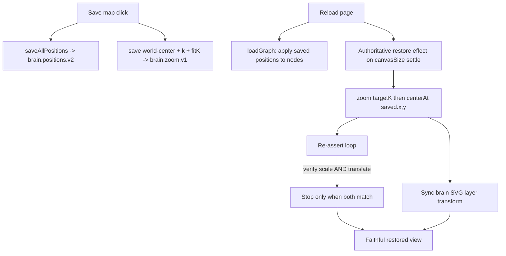

# Requirements

### Overview & Goals
On the Intelligence page (`/intelligence`), the user arranges the Brain Map, clicks **Save map**, and reloads. The map should reload **exactly** as it was saved. Instead, it reloads **offset to one side** (wrong pan/center, and possibly wrong framing). This plan fixes the save/restore pipeline so a saved layout is restored faithfully — same node positions, same zoom level, and same pan/center — across page reloads and on the same screen size.

### Scope
**In scope**
- Correct restoration of the saved **pan/center** (the part currently breaking → "on the side").
- Make the post-load re-assert loop verify the **full transform** (scale **and** translate), not just zoom scale.
- Keep the brain SVG background layer aligned with the node layer after restore.
- Confirm **Save map** and **Reset layout** still behave correctly.

**Out of scope**
- Redesigning the visualization, brain geometry, or force simulation.
- 3D mode layout persistence (only 2D persists positions today).
- Backend/graph data changes.
- Cross-device responsive reframing changes beyond what is needed to stop the offset (kept as-is unless it is the proven cause).

### User Stories
- As a user, I want my saved Brain Map to reload in the **exact same position and zoom** so I don't have to re-pan/re-zoom every time.
- As a user, I want **Reset layout** to reliably return to the factory-default centered view.

### Functional Requirements
1. After **Save map** + reload, the node cloud is centered/panned **identically** to the moment of saving (no sideways offset).
2. The restored **zoom scale** matches the saved scale.
3. The brain silhouette background stays wrapped around the nodes after restore (no drift between the two layers).
4. The restore must be stable: ForceGraph's internal width/height re-init after mount must not leave the view panned off-center.
5. **Reset layout** clears saved positions + zoom and returns to the centered factory default.
6. No regression to the existing "zoom no longer resets on refresh" behavior.

# Technical Design

### Current Implementation
All logic lives in `frontend/src/pages/intelligence.tsx`.

**Save (`saveCurrentView`, `handleZoom`)** — stores, in `localStorage`:
- `brain.positions.v2`: every node's absolute world `{x,y}` (via `saveAllPositions`).
- `brain.zoom.v1`: `{ k, x, y, fitK }` where `x,y` is the **world-space point at the canvas center** computed as `worldCX = (w/2 - t.x) / t.k`, and `fitK` is the canvas's fit zoom at save time.

**Restore (authoritative effect, lines ~787–855)** — when `canvasSize` settles it calls:
```
g.zoom(appliedZoomK(saved, w, h), 0)
g.centerAt(saved.x, saved.y, 0)
```
inside a `setInterval` re-assert loop that fights ForceGraph's internal reset. The loop's **stop condition only checks the live zoom scale** `canvas.__zoom.k` vs `targetK` — it does **not** check the pan/translate. `onEngineStop` and the extension-restore path also re-apply zoom+center.

### Root Cause Analysis
The "loads on the side" offset is a **pan/center restoration failure**, with these contributing causes:

1. **The re-assert loop verifies scale only, not translate.** Once `liveK ≈ targetK` the loop calls `clearInterval` and stops re-applying. ForceGraph re-initializes its transform when its `width`/`height` props settle a few hundred ms after mount; if that reset lands **after** the loop stopped (scale already matched), the **center is left at ForceGraph's default**, producing a sideways offset. The fix must keep re-asserting until **both** scale and the center translate match the target.
2. **`centerAt` depends on current `k` and canvas size.** `centerAt(x,y)` converts a world point to a translate using the live scale and measured canvas size. If `zoom()` hasn't fully applied, or canvas width differs from save-time (e.g., right info panel / `ResizeObserver` timing, or an initial `window.innerWidth` fallback canvas), the computed translate is off → offset. Restore must apply **zoom first, then center**, and re-verify after the canvas size is final.
3. **Brain SVG layer vs node layer** — the brain background (`brainWorldRef`) is transformed via `translate(t.x,t.y) scale(t.k)` only on `onZoom`. Programmatic `zoom`/`centerAt` during restore must reliably fire `handleZoom` (or the brain transform must be explicitly synced) so the silhouette doesn't end up offset relative to the nodes.

### Key Decisions
- **Verify the full transform in the restore loop.** Change the stop condition to also compare the live `canvas.__zoom.x/y` against the expected translate for the saved world-center at the target scale, within a tolerance. This is the primary fix and directly addresses the offset.
- **Deterministic apply order.** Always `zoom(targetK, 0)` then `centerAt(saved.x, saved.y, 0)` using the **same final `canvasSize`** used to compute `targetK`, so center and scale are consistent.
- **Explicitly sync the brain layer on restore.** After each programmatic apply, push the resulting transform into `lastTransformRef`/`brainWorldRef` (or ensure `handleZoom` runs) so the brain background and nodes stay locked together.
- **Keep the auto-save gate semantics** (`zoomCanSaveRef`) so a settling/default transform still cannot clobber the saved value.

### Proposed Changes (all in `frontend/src/pages/intelligence.tsx`)
1. **Add an expected-translate helper.** Given `saved`, `w`, `h`, compute `targetK = appliedZoomK(...)` and the expected canvas translate `tx = w/2 - saved.x * targetK`, `ty = h/2 - saved.y * targetK` (inverse of the save formula).
2. **Upgrade the re-assert loop stop condition** to require both `|liveK - targetK|` and `|liveX - tx|` / `|liveY - ty|` within tolerance before `clearInterval`. Keep the ~3.6s safety cap.
3. **Normalize apply order** in the authoritative effect, `onEngineStop`, and the extension-restore handler: `zoom` then `centerAt`, using the current settled `canvasSize`.
4. **Sync brain layer** after programmatic transforms so the silhouette tracks the nodes (set `brainWorldRef` transform from the applied target, or invoke the same code path as `handleZoom`).
5. **Guard against stale canvas size**: ensure the restore runs/re-runs after the final `ResizeObserver` measurement (it already depends on `canvasSize`; verify no early apply uses a transient size).

### File Structure
- Modified: `frontend/src/pages/intelligence.tsx` (save/restore helpers + the authoritative restore effect + `onEngineStop` + extension-restore handler + brain-sync).
- Possibly read-only reference: `frontend/public/brain-default-layout.json` (factory default; `zoom` is centered `{k:1.26,x:0,y:0,fitK:1.26}`, 3608 positions) — confirms default is centered, so the bug is in user-saved restore, not the default.

### Architecture Diagram


### Risks
- **ForceGraph timing variance**: the verify-both-transform loop must tolerate small float drift; tolerance set relative to `targetK` to avoid an infinite loop (safety cap retained).
- **`centerAt` semantics** in `react-force-graph-2d` must match the inverse formula; will validate empirically against `canvas.__zoom`.
- **Brain-layer sync**: must not introduce a feedback loop with `handleZoom`/auto-save gate.

# Testing

### Validation Approach
Manual verification against the running app at `http://localhost:3000/intelligence` (frontend already runs locally), plus inspection of `localStorage` values and the live `canvas.__zoom` transform to confirm the restore matches the saved transform numerically.

### Key Scenarios
1. **Save + reload (no pan)**: arrange nodes, Save map, reload → view is centered exactly as saved (no side offset).
2. **Save + reload (panned)**: pan the map off-center, Save map, reload → reloads at the same pan/center and zoom.
3. **Zoom + reload**: zoom in, Save map, reload → same zoom scale and center.
4. **Brain alignment**: after reload, the brain silhouette still wraps the node cloud (layers aligned).
5. **Reset layout**: click Reset → returns to centered factory default; reload → still centered default.

### Edge Cases
- Reload with the right info panel open vs collapsed (different canvas width) — center must still match.
- ForceGraph internal width/height reset firing late after mount — loop must keep the center, not drift.
- Legacy saved zoom without `fitK` (fallback to absolute `k`) — must not crash or offset.
- No saved layout → factory default loads centered (unchanged).

### Test Changes
No automated test framework is wired for this page; validation is manual + numeric transform comparison. If a lightweight assertion is desired, a temporary dev-only console check comparing `canvas.__zoom` to the expected `{k,tx,ty}` after restore can be used during verification and removed before finalizing.

# Delivery Steps

### ✓ Step 1: Fix pan/center restoration in the authoritative restore loop
The post-reload re-assert loop verifies the full transform (scale AND translate), so the saved pan/center is restored instead of drifting to the side.

- Add a helper that, from the saved zoom `{k,x,y,fitK}` and the settled `canvasSize`, computes `targetK = appliedZoomK(...)` and the expected canvas translate `tx = w/2 - saved.x*targetK`, `ty = h/2 - saved.y*targetK` (inverse of the save-time `worldCX/worldCY` formula).
- Update the `setInterval` re-assert loop (lines ~836–848) so `clearInterval` only fires when the live `canvas.__zoom` matches BOTH `targetK` and `tx/ty` within a relative tolerance; keep the ~3.6s safety cap.
- Normalize the apply order in the authoritative effect to always `g.zoom(targetK, 0)` then `g.centerAt(saved.x, saved.y, 0)` using the same settled `canvasSize`.

### ✓ Step 2: Make all restore paths consistent (engine stop + extension restore)
Every code path that re-applies the saved view uses the same deterministic zoom-then-center logic, so none of them can leave the map off-center.

- Update `onEngineStop` (lines ~1042–1053) to use the same `targetK`/`centerAt` order and the current settled `canvasSize`.
- Update the JARVIS extension-assisted restore handler (lines ~672–698) to apply zoom-then-center consistently and respect the same verify logic.
- Ensure the auto-save gate (`zoomCanSaveRef`) semantics are preserved so a settling/default transform still cannot overwrite the saved value.

### ✓ Step 3: Keep the brain SVG background aligned with the node layer on restore
After a programmatic restore, the glowing brain silhouette stays wrapped around the nodes instead of sitting off to the side.

- After each programmatic `zoom`/`centerAt` during restore, sync `brainWorldRef` (and `lastTransformRef`) to the applied transform — either by invoking the same path as `handleZoom` or by setting `brainWorldRef.current.style.transform = translate(tx,ty) scale(targetK)` using the computed expected translate.
- Verify no feedback loop with `handleZoom`/auto-save is introduced.

### ✓ Step 4: Verify save, reset, and reload behavior end-to-end
The full save/restore cycle is confirmed correct on the running app, with no regression to existing behavior.

- Manually validate the Key Scenarios from the Testing tab (save+reload centered, save+reload panned, zoom+reload, brain alignment, reset layout) at `http://localhost:3000/intelligence`.
- Numerically compare `canvas.__zoom` after restore against the expected `{k,tx,ty}` and the saved `brain.zoom.v1` values to confirm an exact match.
- Confirm Reset layout still clears `brain.positions.v2` + `brain.zoom.v1` and returns to the centered factory default, and that legacy zoom data without `fitK` still restores without offset.

### ✓ Step 5: Fix the SAVE path so it persists the user's live view (real root cause)
Browser screenshots + numeric capture proved the restore math is correct, but the **save** persists the wrong center: after a real wheel-zoom to live `{k:2.78,x:569.59,y:312.26}` (worldC≈-69.6,-16.6), both auto-save and **Save map** stored `{x:160,y:102}`, and reload faithfully restored that wrong center → the brain's edge shows instead of the user's interior view ("on the side").

- TRUE root cause (found via the library source): `react-force-graph`'s `onZoom` reports `x,y` as the GRAPH-SPACE centre already (it spreads `...this.centerAt()` over the d3 transform — `react-force-graph-2d.js:12772`, comment "report x,y coordinates relative to canvas center"). `handleZoom`/`saveCurrentView` wrongly re-applied `(w/2 - t.x)/t.k`, **double-transforming** the centre, so the persisted value never matched the view → "loads on the side".
- Fix `handleZoom` auto-save to persist `t.x,t.y` directly (they are the world centre); fix `saveCurrentView` to read the live `canvas.__zoom` translate and convert correctly, with the `lastTransformRef` fallback using its centre directly.
- Secondary hardening: guard `onEngineStop`'s re-assert behind `!zoomCanSaveRef.current` so it never overwrites the view/value after the user has taken over. (`brainWorldRef` is unattached, so the brain is a static backdrop — brain-sync is a no-op and not a factor.)
- Verified end-to-end with browser screenshots: zoom/pan → Save map → reload shows IDENTICAL framing; saved `{x:-62,y:-15,k:2.354}` restored to `worldCX:-62,worldCY:-15`; Reset layout clears storage and re-centers to `worldC:0,0`.