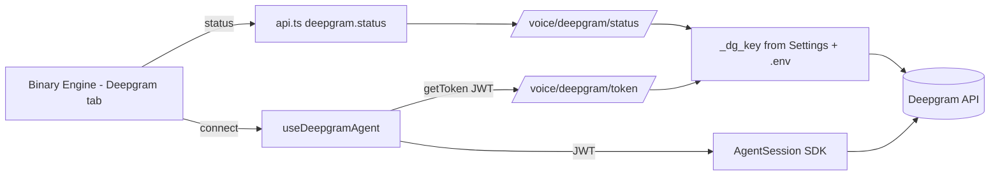

# Requirements

### Overview & Goals
The Deepgram Voice Agent on `http://localhost:3000/binary-engine` (Deepgram Agent tab) is stuck — it shows `connecting…` and then surfaces a raw `Request failed with status code 503`. The goal is to make the agent reliably connect, surface clear/actionable errors instead of raw axios messages, and display the user's Deepgram account/profile details (project, key health, credits) on the page.

### Confirmed Root Cause (from live investigation)
- The Deepgram key **is valid**: direct calls to `https://api.deepgram.com/v1/projects` and `/v1/auth/grant` both return **HTTP 200**; account = `soxentp@gmail.com's Project`, key has the `usage:write` (Member) scope.
- The **running backend** (port `1448`, started via `start.py --reload`) returns `503 {"detail":"DEEPGRAM_API_KEY not configured"}` for `/api/v1/voice/deepgram/token` **and** `/api/v1/voice/deepgram/status`.
- Why: `backend/app/api/voice.py` reads `DEEPGRAM_API_KEY = os.getenv(...)` **once at module import**. The key lives in the root `.env` (line 108) but (a) it is **not** part of the pydantic `Settings`, (b) nothing calls `load_dotenv`, and (c) the launcher injects env only at process launch — the backend was started **before** the key was added, and `--reload` reloads code, not env. So the live process has an empty key.
- The raw `Request failed with status code 503` is the unmapped axios error bubbling out of the `tokenFactory` in `frontend/src/hooks/useDeepgramAgent.ts` via the SDK `sdk-error`/`error` events, bypassing the friendly mapping in `connect()`'s catch.
- The `/voice/deepgram/status` endpoint already returns project name (= account email), credits/balance and key health, but it is **not** wired into `frontend/src/services/api.ts` and **not** rendered on the Deepgram tab — so no profile details are shown.

### Scope
**In scope**
- Make backend Deepgram key loading robust so it no longer depends on a specific launcher or a fresh full restart.
- Surface clear, actionable error messages in the UI (no raw `Request failed with status code 503`).
- Display the Deepgram account/profile (project/email, key health, credits) on the Deepgram tab.
- Pre-flight the connection so the UI never gets stuck on `connecting…`.

**Out of scope**
- Changing the Deepgram models/voices/function-call set.
- The PaulChat voice pipeline / extension chat work (covered by the previous task).
- Rotating or provisioning a new Deepgram API key (the existing key is valid).

### User Stories
- As a user, when I open the Deepgram Agent tab I can see my Deepgram account/project, whether my key is healthy, and remaining credits.
- As a user, when I click **Start Session** the agent connects (given a valid key) instead of hanging on `connecting…`.
- As a user, if the key is missing/misconfigured I see a precise message telling me exactly what to do, not a raw `503`.

### Functional Requirements
- The token + status endpoints must read the key in a way that works regardless of how the backend was launched (root `.env` is always honoured).
- After adding/changing the key in `.env`, a `--reload` code reload must pick it up (read at request time), without requiring a manual full process restart.
- The Deepgram tab shows a profile panel: project name/email, `project_id`, key-health (token grant ok), and credits/balance when available.
- Connection errors map to friendly text, e.g. missing key → "Deepgram key not configured on the backend — add DEEPGRAM_API_KEY to .env and restart the backend."

### Non-Functional Requirements
- No secret key is ever sent to the browser (continue using short-lived JWTs from `/voice/deepgram/token`).
- Backwards compatible: existing `getToken()` / function-call endpoints keep working unchanged.

# Technical Design

### Current Implementation
- **Backend** `backend/app/api/voice.py`
  - `DEEPGRAM_API_KEY = os.getenv("DEEPGRAM_API_KEY", "")` captured at **import time** (line 17).
  - `GET /voice/deepgram/token` → 503 when key empty; otherwise POSTs to `/v1/auth/grant` and returns the bare JWT.
  - `GET /voice/deepgram/status` → returns `{ok, projects, project_id, token_grant, balances, credits_remaining, usage, ...}` but returns `{ok:false}` when key empty.
- **Backend config** `backend/app/core/config.py` — pydantic `Settings` with `env_file=(".env", "../.env", "../../.env")`. `DEEPGRAM_API_KEY` is **absent** from this class.
- **Launcher** `start.py` injects root `.env` into the backend subprocess via `env.setdefault(...)` (lines 780–787) but only at launch; backend runs with `--reload` (port 1448, frontend 3000).
- **Frontend client** `frontend/src/services/api.ts` → `apiClient.deepgram` only has `getToken` and `testKey` (no `status`).
- **Frontend hook** `frontend/src/hooks/useDeepgramAgent.ts` → `tokenFactory` calls `apiClient.deepgram.getToken()`; on 503 the raw axios error is surfaced through `sdk-error`/`error` handlers; `connect()`'s catch has friendly mapping but is bypassed for in-SDK token failures.
- **Frontend page** `frontend/src/pages/binary-engine.tsx` → Deepgram tab (`activeTab === 'deepgram'`, ~line 1507) renders connection row + config; no profile/account panel.

### Key Decisions
- **Load the key via pydantic `Settings` + read at request time.** Add `DEEPGRAM_API_KEY` to `Settings` (its `env_file` already includes `../.env`, which resolves to the root `.env` from the `backend/` cwd), and read it inside the endpoints rather than at import. This removes the dependency on a specific launcher and lets `--reload` pick up a freshly-added key. Rationale: it is the smallest change that fixes the actual failure (stale/empty import-time value) and is consistent with how the rest of the backend reads config.
- **Reuse the existing `/deepgram/status` endpoint for profile.** It already returns project/email + credits + key health; we only need to tidy the response and wire it to the UI. Rationale: avoids a new endpoint and matches existing patterns.
- **Pre-flight + error mapping in the hook.** Validate connectivity (status/token) before/within `connect()` and translate 503/401/403 into actionable text, so the UI never sticks on `connecting…`.

### Proposed Changes
1. `backend/app/core/config.py`: add `DEEPGRAM_API_KEY: str = ""` to `Settings`.
2. `backend/app/api/voice.py`:
   - Replace import-time constant with a small `_dg_key()` helper that returns `settings.DEEPGRAM_API_KEY or os.getenv("DEEPGRAM_API_KEY", "")` (request-time read).
   - Use it in `_dg_headers()`, `deepgram_token()`, `deepgram_status()`.
   - Improve the 503 detail: `"DEEPGRAM_API_KEY not configured — add it to .env and restart the backend"`.
   - In `deepgram_status()`, surface a clean profile block: `account_name`/`email` (from project name), `project_id`, `key_ok` (token grant), `credits_remaining`/`balances`.
3. `frontend/src/services/api.ts`: add `status: () => api.get('/voice/deepgram/status')` to `apiClient.deepgram`.
4. `frontend/src/pages/binary-engine.tsx`: add a "Deepgram Account" panel in the Deepgram tab that fetches `apiClient.deepgram.status()` on tab open and on connect, rendering project/email, key health and credits, plus a Refresh/Test button and a clear missing-key message.
5. `frontend/src/hooks/useDeepgramAgent.ts`: pre-flight token/status before constructing the `AgentSession`; map 503/401/403 to friendly messages in both the `connect()` catch and the `sdk-error`/`error` handlers; ensure a token failure transitions to `disconnected` with an error instead of perpetual `connecting`.

### Data Models / Contracts
```python

# backend/app/api/voice.py

from app.core.config import settings

def _dg_key() -> str:
    return settings.DEEPGRAM_API_KEY or os.getenv("DEEPGRAM_API_KEY", "")
```
```jsonc
// GET /api/v1/voice/deepgram/status (tidied)
{
  "ok": true,
  "account_name": "soxentp@gmail.com's Project",
  "project_id": "15c3165a-…",
  "key_ok": true,
  "credits_remaining": 0.0,
  "balances": [],
  "required_fix": null
}
```
```ts
// frontend/src/services/api.ts
deepgram: {
  getToken: () => /* unchanged */,
  testKey:  () => /* unchanged */,
  status:   () => api.get('/voice/deepgram/status'),
}
```

### Components
- **`voice.py` endpoints** (backend) — request-time key read + richer status.
- **`Settings`** (backend) — owns `DEEPGRAM_API_KEY`.
- **`apiClient.deepgram`** (frontend) — gains `status()`.
- **Deepgram tab** in `binary-engine.tsx` — new account/profile panel + clearer errors.
- **`useDeepgramAgent`** — pre-flight + error mapping.

### File Structure
- Modified: `backend/app/core/config.py`
- Modified: `backend/app/api/voice.py`
- Modified: `frontend/src/services/api.ts`
- Modified: `frontend/src/pages/binary-engine.tsx`
- Modified: `frontend/src/hooks/useDeepgramAgent.ts`

### Architecture Diagram


### Risks
- **Operational restart still needed once**: the currently-running process must be restarted (or reloaded) so the request-time read takes effect; the code change makes future key changes only require a reload. Mitigation: include a restart step in delivery + verify via the live endpoints.
- **Credits scope**: balances require Owner role; if absent the panel must gracefully show "credits unavailable (needs Owner role)" rather than erroring (status endpoint already handles this).
- **Port confusion**: frontend is on 3000, backend on 1448 (`NEXT_PUBLIC_API_URL`); keep using the relative `/api/v1` proxy already in use.

# Testing

### Validation Approach
Verify the fix end-to-end against the running stack (backend `:1448`, frontend `:3000`) using direct HTTP checks and a browser walkthrough of the Deepgram tab, comparing against the reproduced `503` baseline (screenshot captured during investigation).

### Key Scenarios
- `curl /api/v1/voice/deepgram/token` returns **HTTP 200** with a non-empty JWT (after restart/reload).
- `curl /api/v1/voice/deepgram/status` returns `ok:true` with `account_name`, `project_id`, `key_ok:true`.
- Browser: open `/binary-engine` → Deepgram Agent tab → the Account/profile panel shows the project/email and key health.
- Browser: click **Start Session** → state transitions `connecting → connected` (no `503` banner).

### Edge Cases
- Key removed from `.env` + reload → token endpoint returns 503 with the improved message; UI shows the friendly "add DEEPGRAM_API_KEY and restart" text (not raw axios message) and does not hang on `connecting`.
- Key present but lacking Owner scope → status shows key healthy + "credits unavailable" note instead of erroring.
- Backend down entirely → UI shows "Backend not running" mapping.

### Test Changes
- No existing automated tests cover these paths; validation is via `python -m py_compile` for the backend files, `npx tsc --noEmit` for the frontend, the curl checks above, and a Playwright browse + screenshot of the connected state.

# Delivery Steps

### ✓ Step 1: Make backend Deepgram key loading robust
The backend serves a valid Deepgram JWT regardless of launcher, and picks up a freshly-added key on reload.

- Add `DEEPGRAM_API_KEY: str = ""` to the `Settings` class in `backend/app/core/config.py` (its `env_file` already includes `../.env`, so the root key loads automatically).
- In `backend/app/api/voice.py`, remove the import-time `DEEPGRAM_API_KEY = os.getenv(...)` capture and add a `_dg_key()` helper that returns `settings.DEEPGRAM_API_KEY or os.getenv('DEEPGRAM_API_KEY','')` read at request time.
- Update `_dg_headers()`, `deepgram_token()` and `deepgram_status()` to call `_dg_key()`.
- Improve the 503 detail to: `DEEPGRAM_API_KEY not configured — add it to .env and restart the backend`.
- Restart/reload the backend so the running process applies the change, then confirm `GET /api/v1/voice/deepgram/token` returns HTTP 200.

### ✓ Step 2: Expose Deepgram profile via status API and wire frontend client
The frontend can fetch a clean Deepgram account/profile object.

- In `backend/app/api/voice.py` `deepgram_status()`, tidy the response to include `account_name`/email (from the project name), `project_id`, `key_ok` (token-grant result), and `credits_remaining`/`balances`, keeping graceful fallbacks when scopes are missing.
- Add `status: () => api.get('/voice/deepgram/status')` to `apiClient.deepgram` in `frontend/src/services/api.ts`, leaving `getToken`/`testKey` unchanged.
- Verify the endpoint returns `ok:true` with the account name for the valid key.

### ✓ Step 3: Show Deepgram profile and clear health on the Deepgram tab
The Deepgram Agent tab displays the account/profile and key health instead of only a status dot.

- In `frontend/src/pages/binary-engine.tsx` (Deepgram tab, `activeTab === 'deepgram'`), add a "Deepgram Account" panel that calls `apiClient.deepgram.status()` on tab open and after connect.
- Render project name/email, `project_id`, key-health badge, and credits/balance (with a graceful "credits unavailable" note when missing).
- Add a Refresh/Test Connection button and a precise missing-key message linking the fix (add key to .env + restart).

### ✓ Step 4: Fix hook error surfacing and pre-flight the connection
Start Session connects cleanly and never sticks on `connecting…`; errors are actionable, not raw axios text.

- In `frontend/src/hooks/useDeepgramAgent.ts`, pre-flight the token (or status) before constructing `AgentSession`, failing fast to `disconnected` with a clear message on 503/401/403.
- Map the raw `Request failed with status code 503` to "Deepgram key not configured on the backend — add DEEPGRAM_API_KEY to .env and restart" inside both the `connect()` catch and the `sdk-error`/`error` handlers.
- Ensure a token failure always transitions state out of `connecting`.
- Verify with `npx tsc --noEmit`, then browse `/binary-engine`, open the Deepgram tab, confirm the profile shows and Start Session reaches `connected`, and capture a screenshot.