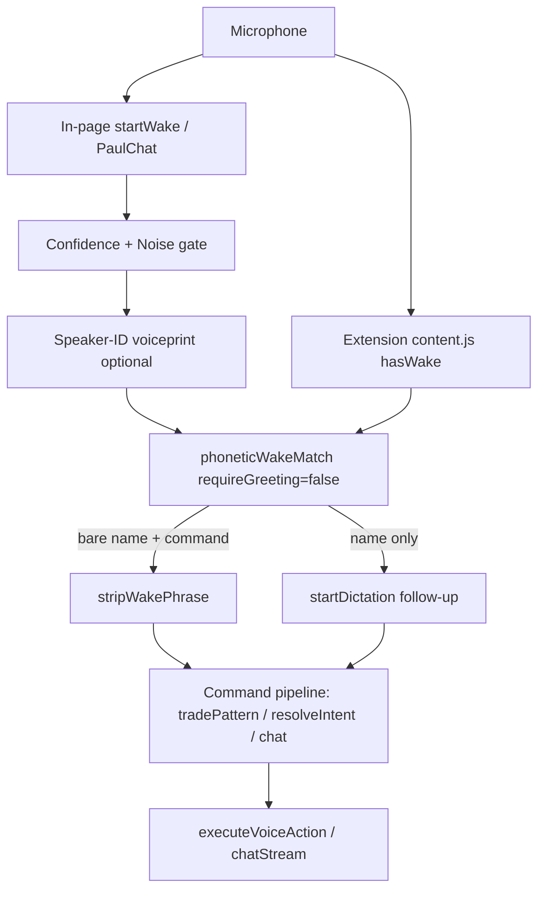

# Requirements

### Overview & Goals
Make JARVIS wake on its **name alone** — you no longer have to say "Hey/Hi Jarvis". Saying _"Jarvis, help analysing Gold for sniper entries"_ in one breath must open the assistant, capture the command, and answer it. False-trigger protection shifts from the rigid greeting-gate to the existing speaker-ID voiceprint + confidence/noise gate.

### Scope
**In scope**
- Drop the mandatory greeting prefix in both wake matchers (in-page `phoneticWakeMatch`, extension `hasWake`).
- Detect the bare name (`jarvis` with fuzzy mis-hearings, and `paul`) anywhere a deliberate command begins.
- Support **single-utterance activation**: "Jarvis, <command>" wakes _and_ runs the command in one breath on the in-page path (the extension already does this).
- Keep a user-facing **"Require greeting"** toggle (default OFF) in the extension popup and the in-page settings panel, so strict mode can be re-enabled in noisy rooms.
- Strip the leading name from the captured command before it reaches the AI.

**Out of scope**
- New command verbs / intent grammar (already covered by `interpretVoiceCommand`).
- Backend AI intent parser, TTS/STT providers, trading logic.
- Speaker-ID voiceprint algorithm itself (reused as-is).

### User Stories
- As a hands-free user, I want to say _"Jarvis, help analysing Gold for sniper entries"_ and have it wake and answer, without prefixing "Hey".
- As a user, I want minor mis-hearings of the name ("jervis", "jarvas", "javis") to still wake JARVIS.
- As a user in a noisy room, I want to flip a "Require greeting" switch back on so the TV stops triggering it.
- As a user, I want my command to be understood cleanly even though it starts with the name (the name shouldn't pollute the question sent to the AI).

### Functional Requirements
1. A transcript beginning with the name (`jarvis`/`paul`, plus fuzzy variants of `jarvis`) wakes JARVIS without any greeting word.
2. "Hey/Hi Jarvis" continues to work (greeting + name is still a valid wake).
3. Wake names are limited to **`jarvis` (with fuzzy tolerance) and `paul`**; the short tokens `j` and `sir` are removed as wake triggers to cut false matches.
4. When the wake utterance also contains a command ("Jarvis, <command>"), the command runs immediately through the existing command/chat pipeline — no second prompt needed.
5. The leading name (and optional greeting) is stripped from the command text before dispatch.
6. A "Require greeting" toggle (default OFF) exists in both the extension popup and the in-page settings; when ON, the previous greeting-gate behavior is restored.
7. Behavior is identical whether or not the browser extension is installed.

### Non-Functional Requirements
- **No regressions:** barge-in/interrupt, speaker-ID gating, confidence/noise gate, and single-mic-owner rule keep working.
- **False-trigger safety:** bare-name activation continues to pass through the confidence/noise gate and (when enabled) the speaker-ID voiceprint.
- **Resilience:** all changes stay inside the existing try/catch-isolated recognizer paths.

# Technical Design

### Current Implementation
- **Shared matcher** `frontend/src/utils/voiceCommands.ts` → `phoneticWakeMatch()` **hard-requires** a greeting word before `jarvis|paul|j` (regex at lines 288–291). `nameLike()` (lines 271–277) accepts `jarvis`/`paul`/`j` + fuzzy.
- **In-page** `frontend/src/components/PaulChat.tsx` → `hasWakeWord()` (line 363) delegates to `phoneticWakeMatch`. The wake listener `startWake` (lines 1618–1684) calls `hasWakeWord(t)`, then **discards the rest of the utterance**, speaks "Yes Sir, I am listening", and starts a fresh `startDictation` (two-phase). The dictation result funnels through `commandRef` → `tradePattern` → `resolveIntentRef` → `sendRef` (lines ~1580–1606).
- **Extension** `jarvis-extension/content.js` → `hasWake()` (lines 60–71) gates on `settings.requireGreeting` (default `true`, line 24). `GREET` (line 59) lists greeting words. `stripWake()` (lines 72–80) removes a greeting+name prefix. The extension already dispatches **wake+command in one utterance** (lines 207–228).
- **Settings UI:** extension popup `popup.js` has a `greetingSwitch` bound to `settings.requireGreeting` (DEFAULTS line 22, `true`). In-page settings panel (`PaulChat.tsx` ~lines 2094–2200) holds the confidence-threshold slider and the speaker-ID toggle — the natural home for a new "Require greeting" switch.
- **False-trigger defenses (independent of greeting):** confidence/noise gate (`noiseThreshold`, line 1634) and speaker-ID voiceprint (`voiceMatchEnabled`/`voiceSimilarity`, line 1638) — these remain the primary defense once the greeting requirement is dropped.

### Key Decisions
1. **Bare name always wakes (greeting optional), per user choice.** Rewrite the shared matcher to fire on the name alone; rely on the existing confidence/noise gate and speaker-ID voiceprint for TV/ambient rejection. Rationale: matches the user's natural phrasing while keeping real defenses intact.
2. **Single shared matcher with a `requireGreeting` flag.** `phoneticWakeMatch(transcript, requireGreeting=false)` is the one source of truth; both `hasWakeWord` (page) and `hasWake` (extension) call the same logic so behavior can't drift.
3. **Wake names limited to `jarvis` (fuzzy) + `paul`.** Remove `j` and `sir` from the name sets in both files to reduce false matches (per user).
4. **One-utterance activation on the in-page path.** When the wake is detected, strip the name and, if a substantive command remains, dispatch it straight into the existing command pipeline instead of re-prompting — so "Jarvis, <command>" works in one breath like the extension already does.
5. **"Require greeting" toggle retained, default OFF.** Persisted in `localStorage` (`paul.wakeRequireGreeting`) for the page and in `settings.requireGreeting` for the extension; flipping ON restores the old strict matcher.

### Proposed Changes
**`frontend/src/utils/voiceCommands.ts`**
- Change signature to `phoneticWakeMatch(transcript: string, requireGreeting = false): boolean`.
  - `requireGreeting === true` → current behavior (greeting + name, fuzzy).
  - `requireGreeting === false` → also match when the transcript **starts with** (or is) a name-like token (`jarvis` fuzzy, or `paul`), e.g. `^\s*(jarvis|paul|<fuzzy>)\b`.
- Add `stripWakePhrase(transcript, requireGreeting=false)` (or export a shared helper) that removes a leading greeting+name OR a leading bare name, returning the remaining command text.
- Update `nameLike()` to drop `j` (keep `jarvis` fuzzy + `paul`).

**`frontend/src/components/PaulChat.tsx`**
- Add `wakeRequireGreeting` state from `localStorage('paul.wakeRequireGreeting')` (default `false`) + a ref.
- `hasWakeWord(t)` → `phoneticWakeMatch(t, wakeRequireGreetingRef.current)`.
- In `startWake.onresult` (lines 1657–1668): after a wake match, compute `cmd = stripWakePhrase(t, ...)`. If `cmd` is a substantive command (length/word check), open the chat and run it **directly** via the existing `commandRef`→`tradePattern`→`resolveIntentRef`→`sendRef` path (one-shot); otherwise keep the current "Yes Sir, I am listening" → `startDictation` two-phase flow.
- Apply the same `stripWakePhrase` + flag in the barge-in branch (lines 1642–1652).
- Add a **"Require greeting"** toggle in the settings panel near the speaker-ID toggle (~line 2186), writing `paul.wakeRequireGreeting`.

**`jarvis-extension/content.js`**
- Change `settings.requireGreeting` default to `false` (line 24).
- Rewrite `hasWake()` so the non-greeting branch matches a **leading/bare** name (`jarvis` fuzzy + `paul`) rather than the name anywhere; remove `j`/`sir` from `nameLike` (line 56) and the name alternations (lines 65/70).
- Extend `stripWake()` to also strip a leading bare name token (not just greeting+name).

**`jarvis-extension/popup.js` + `popup.html` + README**
- `DEFAULTS.requireGreeting` → `false` (popup.js line 22).
- Update the greeting-switch helper text and the "Listening for 'Hey Jarvis'…" status string to reflect that the name alone now works.
- Update `jarvis-extension/README.md` usage notes ("Say 'Jarvis, …'").

### Data Models / Contracts
```ts
// voiceCommands.ts
export function phoneticWakeMatch(transcript: string, requireGreeting?: boolean): boolean
export function stripWakePhrase(transcript: string, requireGreeting?: boolean): string
```
```js
// content.js settings (default)
settings = { enabled: true, wakeWord: 'jarvis', requireGreeting: false, lang: 'en-US', notifications: true }
```

### Architecture Diagram


### Risks
- **More false triggers in noisy rooms** once the greeting is optional → mitigated by the confidence/noise gate, the speaker-ID voiceprint, and the user-facing "Require greeting" toggle to restore strict mode.
- **Bare name appears mid-sentence in ambient audio** → restrict the non-greeting match to the **start** of the utterance and keep removing `j`/`sir` to limit accidental matches.
- **Double execution (extension + page)** → unchanged single-owner guard (`extVoiceReadyRef`); both paths still funnel through the same pipeline.
- **Name leaking into the AI question** → `stripWakePhrase` removes the leading name/greeting before dispatch.

# Testing

### Validation Approach
Drive each case through the real path: feed transcripts into `phoneticWakeMatch`/`stripWakePhrase` and the in-page `startWake`→pipeline, and simulate the extension `hasWake`/`stripWake` + `command` postMessage. Confirm the build and IDE inspections are clean after edits.

### Key Scenarios
- **Bare name + command (target):** "Jarvis, help analysing Gold for sniper entries" → wakes, strips "Jarvis", sends "help analysing Gold for sniper entries" to the AI in one breath.
- **Bare name only:** "Jarvis" → wakes and prompts for the follow-up command (two-phase).
- **Greeting still works:** "Hey Jarvis, open MT5 Live" → wakes and navigates.
- **Fuzzy name:** "Jervis, scroll down" / "Jarvas" → still wakes.
- **Paul alias:** "Paul, what are my open positions" → wakes.
- **Toggle ON (strict):** with "Require greeting" ON, bare "Jarvis help…" is ignored; "Hey Jarvis…" still works.

### Edge Cases
- **`j` / `sir` removed:** "sir, …" or a stray "j" no longer wakes.
- **Ambient/TV bare 'jarvis' mid-sentence:** rejected by confidence/noise gate and (when enabled) speaker-ID; non-greeting match only fires at the start of the utterance.
- **Barge-in:** saying the name during TTS still interrupts and captures the new command, with the name stripped.
- **Single-owner:** extension active → in-page recognizer stays suppressed (no double action).
- **Extension vs page parity:** identical wake/strip behavior in both, default greeting OFF.

### Test Changes
- If a frontend unit-test setup exists, add cases for `phoneticWakeMatch(transcript, requireGreeting)` and `stripWakePhrase` (bare name, greeting+name, fuzzy, `paul`, removed `j`/`sir`). Otherwise validate via build + inspections and manual transcript walkthroughs.

# Delivery Steps

### ✓ Step 1: Rewrite the shared wake matcher for bare-name activation
The shared matcher in `frontend/src/utils/voiceCommands.ts` wakes on the name alone and exposes a strip helper.

- Change `phoneticWakeMatch(transcript)` to `phoneticWakeMatch(transcript, requireGreeting = false)`: keep the existing greeting+name path when `requireGreeting` is true, and add a bare-name branch that matches when the utterance **starts with** a name-like token (`jarvis` with fuzzy tolerance, or `paul`).
- Add/export `stripWakePhrase(transcript, requireGreeting = false)` that removes a leading greeting+name OR a leading bare name and returns the remaining command text.
- Update `nameLike()` to drop the `j` short token (keep `jarvis` fuzzy + `paul`).
- Keep all functions pure (no DOM/router access).

### ✓ Step 2: Wire the in-page widget to bare-name + one-utterance commands and add the greeting toggle
`PaulChat.tsx` wakes on the bare name, runs single-breath commands, and offers a 'Require greeting' switch.

- Add `wakeRequireGreeting` state + ref backed by `localStorage('paul.wakeRequireGreeting')`, default OFF.
- Update `hasWakeWord(t)` to call `phoneticWakeMatch(t, wakeRequireGreetingRef.current)`.
- In `startWake.onresult`, after a wake match compute `stripWakePhrase(t, ...)`: if a substantive command remains, open the chat and dispatch it directly through the existing `commandRef` → `tradePattern` → `resolveIntentRef` → `sendRef` pipeline (one-shot); otherwise fall back to the current 'Yes Sir, I am listening' → `startDictation` two-phase flow.
- Apply the same strip + flag in the barge-in branch so name-only interrupts also work hands-free.
- Add a 'Require greeting' toggle to the settings panel next to the speaker-ID toggle, persisting `paul.wakeRequireGreeting`.
- Preserve confidence/noise gating, speaker-ID gating, and the single-mic-owner guard.

### ✓ Step 3: Bring the browser extension to parity and update its UI
The extension wakes on the bare name by default with matching strip logic and updated popup copy.

- In `jarvis-extension/content.js`, set the `settings.requireGreeting` default to `false`, rewrite `hasWake()` so the non-greeting branch matches a leading/bare name (`jarvis` fuzzy + `paul`), and remove `j`/`sir` from `nameLike` and the name alternations.
- Extend `stripWake()` to also strip a leading bare-name token, not just greeting+name.
- In `jarvis-extension/popup.js`, set `DEFAULTS.requireGreeting` to `false` and update the greeting-switch helper text and the 'Listening for "Hey Jarvis"…' status string to reflect name-only activation.
- Update `popup.html` label text and `jarvis-extension/README.md` usage instructions to describe saying 'Jarvis, …' without a greeting.