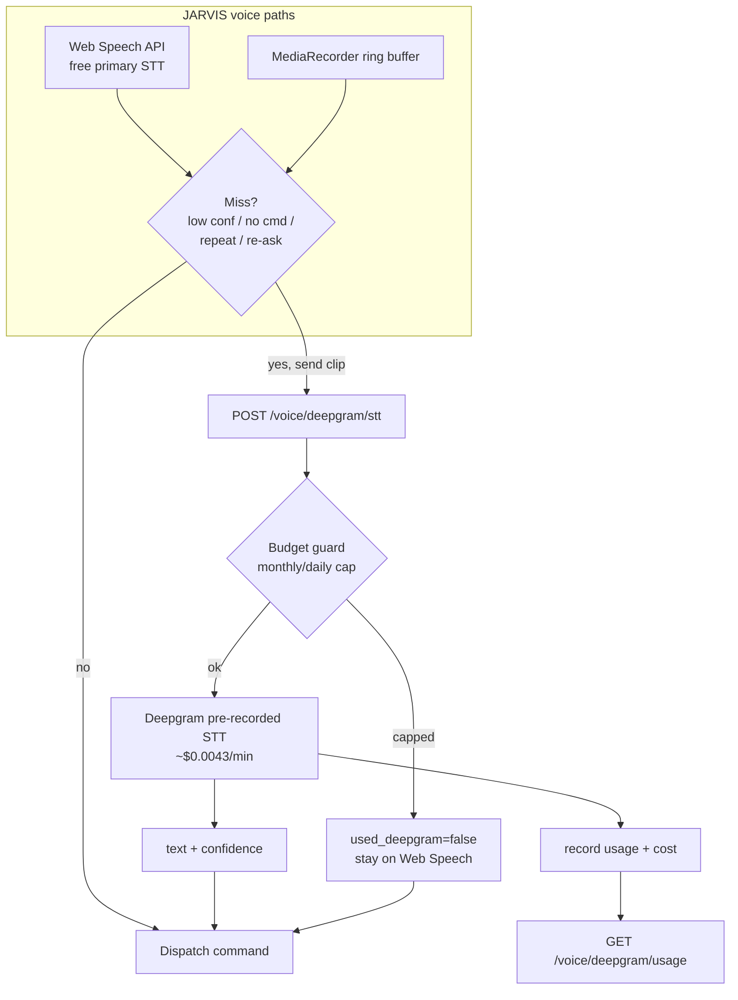

# Requirements

### Overview & Goals
Make Deepgram a **cost-aware fallback** for JARVIS voice recognition rather than an always-on engine. JARVIS keeps using the **free browser Web Speech API** as its primary recognizer and only escalates a single missed utterance to Deepgram when it genuinely cannot hear the command. A backend **budget guard** caps spend so the $200 Deepgram credit lasts **3+ months**.

**Why this matters:** Today Deepgram is only wired into the separate *Voice Agent* tab in `binary-engine.tsx` (`useDeepgramAgent.ts`), which runs the full STT+LLM+TTS agent at **~$0.08/min** — at that rate $200 lasts only ~40 hours. The fallback will instead use Deepgram **pre-recorded STT (Nova, ~$0.0043/min)** — ~15–20× cheaper — on just the short failed clip.

### Scope
**In Scope**
- Cheap on-demand Deepgram **pre-recorded STT** of a buffered audio clip, triggered only on a recognition "miss".
- Fallback wired into **both** JARVIS voice paths: in-page (`PaulChat.tsx`) and the browser extension (`jarvis-extension/`).
- Backend **budget guard**: monthly (~$60) + daily sub-cap, usage tracking, and a usage/runway endpoint.
- Silent degradation: when the cap is hit, JARVIS quietly stays on the free Web Speech API.

**Out of Scope**
- Rewriting the existing *Voice Agent* tab in `binary-engine.tsx` (kept as-is; optionally guarded — see Technical Design Risks).
- Replacing the free Web Speech API as the primary recognizer.
- New TTS provider work (browser/OpenAI TTS unchanged).

### User Stories
- As a trader, I want JARVIS to fall back to Deepgram **only when it mis-hears me**, so my commands still land without wasting credits.
- As the account owner, I want a **hard monthly spend cap** so the $200 credit lasts 3+ months and never silently drains.
- As a user, when the cap is reached I want JARVIS to **keep working on the free engine** without errors.

### Functional Requirements
1. **Trigger conditions** (any of these escalates one utterance to Deepgram):
   - Web Speech confidence below a configurable threshold.
   - Wake word heard but the command was empty/garbled/too short.
   - N consecutive misses within a short window.
   - Manual re-ask (user repeats a wake name immediately, or taps a "use Deepgram" control).
2. **One-shot transcription**: only the buffered ~5–8s clip of the failed utterance is sent; no continuous streaming.
3. **Budget enforcement**: the backend tracks spend; when the monthly/daily cap is reached it returns `used_deepgram=false` and JARVIS **silently** stays on Web Speech (no error shown).
4. **Security**: the raw Deepgram key never leaves the backend (same posture as the existing token endpoint).
5. **Transparency**: a usage endpoint reports month/day spend, remaining budget, and projected runway; a small status indicator reflects whether the fallback is armed or paused.

### Non-Functional Requirements
- **Cost**: at ~$0.0043/min, a $60/month cap allows ~465 min/day of fallback audio — far beyond expected misses; $200 → 3+ months guaranteed by the hard cap.
- **Latency**: pre-recorded round-trip on a short clip should feel like a brief "let me re-check" beat (sub-2s typical).
- **Resilience**: any Deepgram/backend failure degrades silently to the free engine.

# Technical Design

### Current Implementation
- **Primary STT = free Web Speech API**, in two places:
  - `frontend/src/components/PaulChat.tsx` — in-page mic; `getSpeechRecognition()`, `pickAlternative()` (scores `maxAlternatives` by learned vocab + `alt.confidence`), `learnAndCorrect()` vocab correction, voice-profile calibration.
  - `jarvis-extension/content.js` — owns the mic when installed; `startRecognition()` with `rec.maxAlternatives = 5`, `pickBest()` (confidence + vocab), wake/command phases, and an existing `getUserMedia` stream in `initFreqAnalyser()`.
- **Deepgram today**: only `frontend/src/pages/binary-engine.tsx` via `frontend/src/hooks/useDeepgramAgent.ts` (full Voice Agent, ~$0.08/min). Not used by JARVIS commands.
- **Backend** `backend/app/api/voice.py`: `_dg_key()`, `/voice/deepgram/token`, `/voice/deepgram/status`; unused OpenAI Whisper `/voice/stt`. **No usage/budget tracking.**
- **Persistence pattern**: `backend/app/api/jarvis.py` persists voice-brain data as a JSON file via `Path.read_text/write_text` (no DB) — we mirror this for usage tracking.
- **Extension→backend bridge**: `jarvis-extension/background.js` `apiFetch()` → `http://localhost:1448/api/v1`; `host_permissions` already include the backend origin.
- **API client**: `frontend/src/services/api.ts` `apiClient.deepgram` (`getToken`, `testKey`, `status`).

### Key Decisions
- **Pre-recorded one-shot STT, not the Voice Agent** — ~15–20× cheaper; the deciding factor for the 3-month runway. *(confirmed)*
- **Backend-authoritative budget guard** — the only place that can enforce spend and protect the secret key. Client never decides budget. *(confirmed: silent fallback, ~$60/mo cap)*
- **Rolling client-side audio buffer** — Web Speech gives text but no audio, so each path keeps a short `MediaRecorder` ring buffer to have a clip available the instant a miss is detected.
- **Shared miss-detection semantics** across in-page and extension so behavior is consistent.
- **Free engine stays primary** — Deepgram is strictly a per-utterance escalation.

### Proposed Changes
**Backend (`backend/app/api/voice.py` + new helper + `config.py`)**
- New `POST /voice/deepgram/stt` (multipart audio clip):
  1. Consult the budget guard; if capped → return `{ used_deepgram: false, reason: "budget_capped" }` (HTTP 200).
  2. Else POST the clip to Deepgram pre-recorded `https://api.deepgram.com/v1/listen?model=nova-3&smart_format=true` with `Authorization: Token <key>` (server-side only).
  3. Record usage (clip duration → cost), return `{ used_deepgram: true, text, confidence, budget }`.
- New `GET /voice/deepgram/usage` → `{ month_spend, day_spend, monthly_cap, daily_cap, remaining, projected_runway_days }`.
- New `backend/app/services/deepgram_budget.py` — JSON-file usage store (mirrors `jarvis.py` voice-brain persistence): `can_spend()`, `record_usage(seconds)`, `summary()`; rolls over by month/day.
- New `config.py` settings: `DEEPGRAM_MONTHLY_CAP_USD=60.0`, `DEEPGRAM_DAILY_CAP_USD=5.0`, `DEEPGRAM_STT_RATE_PER_MIN=0.0043`, `DEEPGRAM_STT_MODEL="nova-3"`, `DEEPGRAM_FALLBACK_ENABLED=True`.

**Frontend in-page (`PaulChat.tsx` + `api.ts`)**
- Add a rolling `MediaRecorder` ring buffer (~6–8s) on the existing mic stream.
- Add a miss-detector implementing the 4 triggers (low confidence via `pickAlternative` result, wake-without-command, consecutive-miss counter, manual re-ask).
- On miss + not-capped: extract the buffered clip, `POST` to `/voice/deepgram/stt`; if `used_deepgram` and `text`, run it through `learnAndCorrect()` and dispatch via the existing command path.
- Extend `apiClient.deepgram` with `sttFallback(blob)` and `usage()`.
- Small status line/badge: "Deepgram fallback: armed / paused (budget)".

**Extension (`content.js` + `background.js`)**
- `content.js`: attach a `MediaRecorder` ring buffer to the existing `initFreqAnalyser()` stream; reuse the existing wake/command + `pickBest` confidence to detect misses; on miss send the clip blob to background.
- `background.js`: add a `deepgram-stt` message handler that `apiFetch`es the clip (multipart) to `/voice/deepgram/stt`, returns the transcript to `content.js`, which feeds it into `dispatchCommand()`.

### Data Models / Contracts
```jsonc
// POST /voice/deepgram/stt  (multipart: file=<audio/webm clip>)
// 200 OK
{ "used_deepgram": true, "text": "analyse gold for sniper entries",
  "confidence": 0.94,
  "budget": { "month_spend": 3.21, "monthly_cap": 60, "remaining": 56.79 } }
// capped
{ "used_deepgram": false, "reason": "budget_capped",
  "budget": { "month_spend": 60.0, "monthly_cap": 60, "remaining": 0 } }
```
```jsonc
// GET /voice/deepgram/usage
{ "month_spend": 3.21, "day_spend": 0.42, "monthly_cap": 60, "daily_cap": 5,
  "remaining": 56.79, "projected_runway_days": 124 }
```
```ts
// frontend/src/services/api.ts — apiClient.deepgram additions
sttFallback: (clip: Blob) => /* multipart POST /voice/deepgram/stt */
usage:       () => api.get('/voice/deepgram/usage')
```

### Components
- **`PaulChat.tsx`** (modified) — adds audio ring buffer, miss-detector, Deepgram escalation, status indicator.
- **`jarvis-extension/content.js`** (modified) — audio ring buffer + miss escalation message.
- **`jarvis-extension/background.js`** (modified) — `deepgram-stt` relay to backend.
- **`backend/app/api/voice.py`** (modified) — `/deepgram/stt`, `/deepgram/usage`.
- **`backend/app/services/deepgram_budget.py`** (new) — budget guard + usage store.
- **`backend/app/core/config.py`** (modified) — cap/rate settings.
- **`frontend/src/services/api.ts`** (modified) — `sttFallback`, `usage`.

### File Structure
```
backend/app/api/voice.py            # + /deepgram/stt, /deepgram/usage
backend/app/services/deepgram_budget.py   # NEW budget guard (JSON-file usage store)
backend/app/core/config.py          # + DEEPGRAM_* cap/rate settings
frontend/src/services/api.ts        # + deepgram.sttFallback, deepgram.usage
frontend/src/components/PaulChat.tsx # + audio buffer, miss detector, escalation, status
jarvis-extension/content.js         # + audio buffer + miss escalation
jarvis-extension/background.js       # + deepgram-stt relay
```

### Architecture Diagram


### Risks
- **Audio capture while Web Speech runs**: both can share one `getUserMedia` stream (extension already opens one in `initFreqAnalyser`); avoid opening duplicate mics. Mitigation: attach `MediaRecorder` to the existing stream.
- **Voice Agent tab still expensive**: it remains on `binary-engine.tsx`. Optional safeguard — surface remaining budget there and/or warn before connecting, so manual agent use doesn't blow the cap.
- **Clock/rollover correctness**: usage store must roll month/day boundaries reliably (store ISO period keys).
- **Codec compatibility**: send `audio/webm;codecs=opus` (browser default) — Deepgram pre-recorded accepts it; set `Content-Type` accordingly.

# Testing

### Validation Approach
Verify the fallback fires **only** on misses, stays within budget, and degrades silently when capped. Use the existing dev backend (port 1448) and frontend (port 3000). The agent validates via targeted unit-style checks and manual API calls; live mic checks are noted for the user.

### Key Scenarios
- **Clean recognition (no escalation)**: a confidently-recognized command dispatches via Web Speech and never calls `/voice/deepgram/stt`.
- **Low-confidence miss**: a low-confidence result triggers one `/voice/deepgram/stt` call; returned text is corrected via `learnAndCorrect()` and dispatched.
- **Wake-without-command**: "Jarvis…" then a garbled command escalates exactly once.
- **Repeated misses**: N consecutive misses escalate; the counter resets after a success.
- **Budget endpoint math**: `GET /voice/deepgram/usage` reflects recorded clip seconds × rate; `remaining` and `projected_runway_days` compute correctly.
- **Cap reached**: with usage forced past the monthly cap, `/voice/deepgram/stt` returns `used_deepgram=false` and the client stays on Web Speech with no error UI.

### Edge Cases
- Deepgram/network error → endpoint returns a safe `used_deepgram=false`; client falls back silently.
- Missing `DEEPGRAM_API_KEY` → same friendly degradation as the existing token endpoint (503 mapping reused).
- Empty/too-short audio clip → skip the call entirely (no spend).
- Month/day rollover → spend counters reset for the new period.
- Extension path: with the extension installed it (not the page) owns the mic — ensure only one path escalates a given miss.

### Test Changes
- Add backend tests for `deepgram_budget.py` (`can_spend`, `record_usage`, rollover) and for `/voice/deepgram/stt` cap behavior (mock the Deepgram HTTP call).
- Add a small test/asserts for the `/voice/deepgram/usage` math.
- Manual checklist (user-run, documented in README/QUICKREF): mic miss → Deepgram escalation → command lands; forced cap → silent free-only.

# Delivery Steps

### ✓ Step 1: Backend: cheap Deepgram STT endpoint + budget guard
A backend can transcribe a short audio clip via Deepgram pre-recorded STT, enforce a monthly/daily spend cap, and report usage.

- Add `backend/app/services/deepgram_budget.py`: a JSON-file usage store (mirroring the `jarvis.py` voice-brain persistence) with `can_spend()`, `record_usage(seconds)`, and `summary()`, rolling over by month and day using ISO period keys.
- Add settings to `backend/app/core/config.py`: `DEEPGRAM_MONTHLY_CAP_USD=60.0`, `DEEPGRAM_DAILY_CAP_USD=5.0`, `DEEPGRAM_STT_RATE_PER_MIN=0.0043`, `DEEPGRAM_STT_MODEL='nova-3'`, `DEEPGRAM_FALLBACK_ENABLED=True`.
- Add `POST /voice/deepgram/stt` to `backend/app/api/voice.py`: accept a multipart audio clip, check the budget guard, call Deepgram pre-recorded `v1/listen` server-side (reusing `_dg_key()`/`_dg_headers()`), record usage, and return `{ used_deepgram, text, confidence, budget }`; return `used_deepgram=false` when capped, key-missing, or on any Deepgram error.
- Add `GET /voice/deepgram/usage` returning month/day spend, caps, remaining, and projected runway days.
- Add backend tests covering cap enforcement, rollover, and usage math (mocking the Deepgram HTTP call).

### ✓ Step 2: In-page fallback in PaulChat (audio buffer + miss detection + escalation)
JARVIS's in-page voice path escalates a missed utterance to Deepgram only when needed and silently stays on Web Speech when capped.

- In `frontend/src/components/PaulChat.tsx`, add a rolling `MediaRecorder` ring buffer (~6–8s) attached to the mic stream, cleaned up on unmount/disable.
- Implement a miss-detector covering all four triggers: low confidence (from the `pickAlternative` result/`alt.confidence`), wake-word-without-command, N consecutive misses, and manual re-ask.
- On a miss with budget available, extract the buffered clip and POST it via a new `apiClient.deepgram.sttFallback(blob)` in `frontend/src/services/api.ts`; when `used_deepgram` is true, run the returned text through `learnAndCorrect()` and dispatch through the existing command path.
- Add `apiClient.deepgram.usage()` and a small status indicator ("fallback armed / paused (budget)") that reads it; render nothing intrusive when capped.

### ✓ Step 3: Extension fallback (content.js buffer + background.js relay)
The jarvis-extension listening path gets the same cost-aware Deepgram fallback so it works however the user listens.

- In `jarvis-extension/content.js`, attach a `MediaRecorder` ring buffer to the existing `initFreqAnalyser()` `getUserMedia` stream (no second mic), and reuse the existing wake/command phases + `pickBest` confidence to detect a miss.
- On a miss, send the buffered clip to the service worker via `api.runtime.sendMessage({ type: 'deepgram-stt', ... })`.
- In `jarvis-extension/background.js`, add a `deepgram-stt` handler that `apiFetch`es the clip (multipart) to `/voice/deepgram/stt` and returns the transcript; `content.js` then feeds the text into `dispatchCommand()`.
- Ensure only one path escalates a given miss (extension owns the mic when installed).

### ✓ Step 4: Budget surfacing, safeguards, and docs
The user can see remaining Deepgram budget/runway, and the expensive Voice Agent tab is protected from accidentally draining the cap.

- Surface remaining monthly budget and projected runway in the JARVIS settings area (in-page) using `apiClient.deepgram.usage()`.
- In `frontend/src/pages/binary-engine.tsx` (Voice Agent tab), show the remaining-budget figure near the connect control and a brief warning that the agent (~$0.08/min) is far more costly than the fallback; optionally block/confirm connect when the cap is exhausted.
- Update `README.md`/`QUICKREF.md` and `jarvis-extension/README.md` with how the cost-aware fallback works, the cap settings, and a manual verification checklist (miss → Deepgram escalation; forced cap → silent free-only).