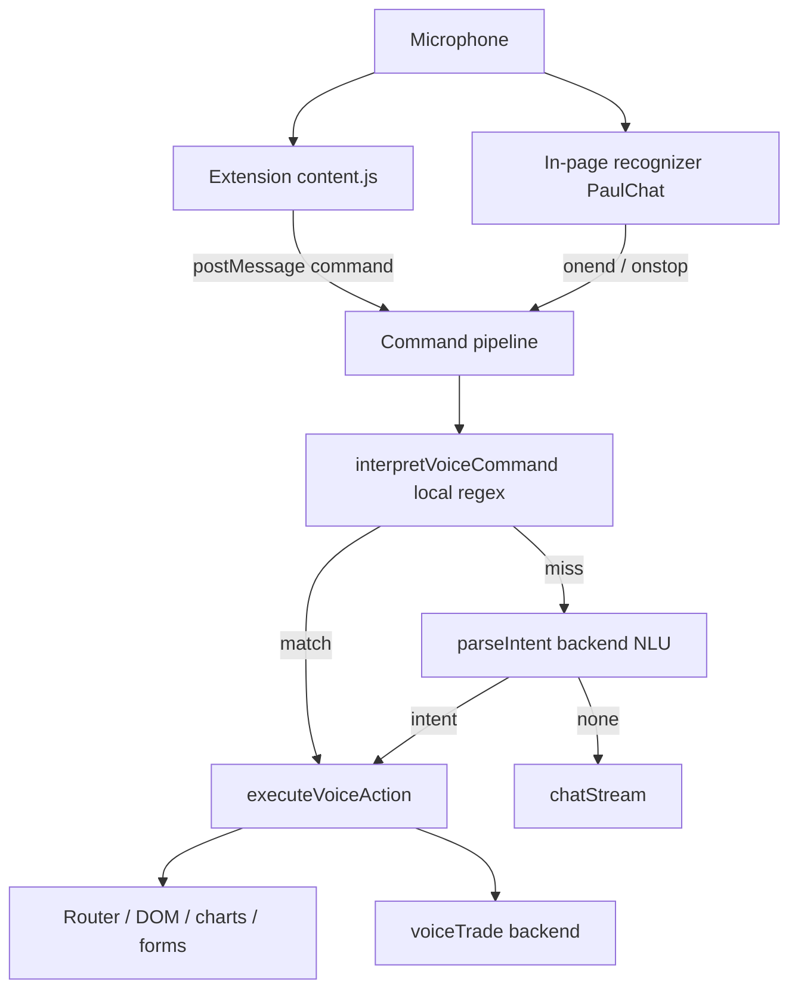

# Requirements

### Overview & Goals
Make JARVIS a complete, low-latency, hands-free operator for the trading app. Build on the existing voice stack (extension mic ownership, in-page wake + dictation, regex command interpreter, voice-trade) to:

- **Wire every core app function to voice** so a user with no hands can drive the entire app.
- **Improve detection speed** from speech → action (instant local intents, faster confirmations, shorter STT).
- **Improve listening & voice detection** (adaptive noise gating, fuzzy/phonetic wake matching, fewer false wakes, more reliable capture).
- **Understand natural phrasing** via an AI intent fallback when fixed patterns miss.

### Scope
**In scope**
- Expand `frontend/src/utils/voiceCommands.ts` intent coverage and matching.
- Expand `executeVoiceAction` in `frontend/src/components/PaulChat.tsx` to perform new action types (form fill, select/dropdown, toggle, tab switch, chart/timeframe controls, trading actions).
- Hybrid command interpretation: local regex first, backend AI intent parser fallback, then chat.
- Listening/speed improvements in the in-page recognizer (`PaulChat.tsx`) and the extension (`jarvis-extension/content.js`).
- A backend intent-parse endpoint under the existing `plugins/agent-paul` API.

**Out of scope**
- Replacing the trading backend logic itself (voice-trade endpoint already exists).
- Rebuilding the TTS/STT providers; we reuse `/voice/tts` and `/voice/stt`.
- Non-voice UI redesign.

### User Stories
- As a hands-free user, I want to fill and submit any form by voice (“set amount to 100”, “select BTCUSDT”, “submit”) so I never touch the keyboard.
- As a trader, I want to control charts and trading actions by voice (“switch to 15 minute”, “set leverage 10”, “close all positions”) so I act fast.
- As a user in a noisy room, I want JARVIS to ignore the TV but reliably catch my real commands.
- As a user, I want JARVIS to understand natural phrasing (“can you take me over to the futures screen”) even when it isn’t an exact command.
- As a user, I want near-instant response between speaking and the action happening.

### Functional Requirements
1. New voice action types are recognized and executed: `set_field` (named field), `select_option`, `toggle`, `switch_tab`, `set_timeframe`, `submit_form`, `cancel`, plus richer trading verbs (set leverage/amount, close position(s)).
2. Unmatched transcripts are sent to a backend intent parser; a returned structured intent is executed through the same action pipeline; only true misses fall through to chat.
3. Wake detection tolerates minor mis-hearings (fuzzy/phonetic match) while keeping the greeting-gate to reject bare TV mentions.
4. Noise threshold adapts to the ambient level instead of a single fixed value; end-of-speech is detected sooner for faster dictation turnaround.
5. Confirmation speech for fast actions is short/optional so it does not delay the action.
6. The extension and in-page path expose the same new commands so behavior is identical whether or not the extension is installed.

### Non-Functional Requirements
- **Latency:** local intents act in < 100 ms after final transcript; AI fallback bounded (e.g. ~1.5 s timeout) and never blocks local intents.
- **Compatibility:** preserve single-mic-owner rule (extension OR in-page, never both).
- **Resilience:** all new paths are try/catch isolated; failures degrade to chat, never crash the recognizer.
- **No regressions:** existing barge-in/interrupt, speaker-ID gating, and 26-route navigation keep working.

# Technical Design

### Current Implementation
- **Mic ownership:** `jarvis-extension/content.js` owns one `SpeechRecognition`, detects the wake phrase (`hasWake`/`stripWake`), captures the follow-up command, and posts `wake`/`command`/`interrupt`/`status` to the page via `window.postMessage`. In-page recognizers are suppressed when the extension is active (`extVoiceReadyRef`).
- **In-page path:** `PaulChat.tsx` runs `startWake` (continuous) and `startDictation` (Web Speech or AI Whisper via `/voice/stt`). Noise gating uses `noiseThresholdRef` confidence checks; `voiceMatchRef` gates by speaker profile; `interruptSpeech` handles barge-in; `speak` uses `/voice/tts` or system voice.
- **Command interpreter:** `frontend/src/utils/voiceCommands.ts` `interpretVoiceCommand()` returns a pure `VoiceAction` (navigate/click/type/scroll/back/…). `executeVoiceAction()` in `PaulChat.tsx` performs it (router push, `clickByText`, `typeIntoField`, scroll, etc.). Both the extension command path (`processExtCommand`) and in-page path funnel through `commandRef.current` then a `tradePattern` check then `sendRef`.
- **APIs:** `apiClient.jarvis.chatStream`, `voiceTrade` → `/plugins/agent-paul/*`; TTS/STT → `/voice/tts`, `/voice/stt`.

### Key Decisions
1. **Hybrid command interpretation (local-first + AI fallback).** Keep the instant client-side regex for known intents; when it misses, call a new backend intent-parse endpoint that returns a structured `VoiceAction`-compatible object; if that also returns nothing, fall through to chat. Rationale: preserves sub-100ms response for the common case while adding natural-language flexibility, without making every command pay a network round-trip.
2. **Single shared action vocabulary.** Extend the `VoiceAction` union once in `voiceCommands.ts`; both extension and in-page commands run through the same `executeVoiceAction`, so coverage is added in one place and stays consistent.
3. **Adaptive noise gating.** Replace the single fixed `noiseThreshold` comparison with a short rolling ambient-confidence baseline so quiet rooms are sensitive and noisy rooms are stricter — reduces both missed commands and false wakes.
4. **Fuzzy/phonetic wake matching** (shared helper) in both `hasWakeWord` (page) and `hasWake` (extension), keeping the greeting-gate to avoid bare-name TV triggers.
5. **Speed-tuned confirmations.** Fast UI actions (navigate/click/scroll/toggle) use short or no spoken ack and execute immediately; only ambiguous/long actions speak first.

### Proposed Changes
**`frontend/src/utils/voiceCommands.ts`**
- Extend `VoiceAction.type` with: `set_field`, `select_option`, `toggle`, `switch_tab`, `set_timeframe`, `submit_form`, `cancel`, and trading verbs (`set_leverage`, `set_amount`, `close_position`, `close_all`).
- Add parsing rules + a small fuzzy matcher for field/option/tab labels; export a shared `phoneticWakeMatch()` helper.
- Keep `interpretVoiceCommand` pure (no DOM); it returns the structured action only.

**`frontend/src/components/PaulChat.tsx`**
- Extend `executeVoiceAction` switch with handlers for each new action type: `set_field`/`select_option`/`toggle` via DOM helpers (extend `typeIntoField`, add `setSelectByText`, `toggleByText`), `switch_tab`/`set_timeframe` via `clickByText` against tab/timeframe controls, `submit_form`/`cancel` via nearest form submit/escape, trading verbs via `apiClient.jarvis.voiceTrade`.
- Add `resolveIntentRemote(text)` that calls the new backend endpoint when `commandRef.current(text)` misses, before falling through to chat. Apply it in both dictation paths (`startDictation` Web Speech `onend` and Whisper `onstop`) and in `processExtCommand`.
- Implement adaptive noise gating (rolling ambient baseline feeding `noiseThresholdRef`) and shorter end-of-speech timeout for faster turnaround; make confirmation speech conditional on action type.
- Use the shared `phoneticWakeMatch()` in `hasWakeWord`.

**`jarvis-extension/content.js`**
- Use a phonetic/fuzzy variant of `hasWake`/`stripWake`; tune `commandTimer` / end-of-utterance for faster dispatch; relay the same new command strings unchanged (page resolves them), keeping the existing barge-in logic.

**Backend (`backend/app/plugins/agent_paul`)**
- Add `POST /plugins/agent-paul/intent` accepting `{ text, pathname }` and returning a structured intent (`{ type, target?, text?, path?, value? }`) or `{ type: 'none' }`, reusing the existing agent/LLM wiring. Add `apiClient.jarvis.parseIntent(text, pathname)` in `frontend/src/services/api.ts`.

### Data Models / Contracts
```ts
// voiceCommands.ts (extended)
type VoiceAction = { type:
 'navigate' | 'click' | 'type' | 'scroll' | 'back' | 'forward' | 'reload'
 'top' | 'bottom' | 'open_chat' | 'close_chat' | 'new_chat'
 'stop_listening' | 'repeat' | 'help'
 'set_field' | 'select_option' | 'toggle' | 'switch_tab' | 'set_timeframe'
 'submit_form' | 'cancel'
 'set_leverage' | 'set_amount' | 'close_position' | 'close_all';
  path?: string; target?: string; field?: string; value?: string;
  text?: string; direction?: 'up'|'down'; say: string }
```
```
POST /plugins/agent-paul/intent
  body: { text: string, pathname?: string }
  200:  { type: string, target?: string, field?: string, value?: string,
          path?: string, say?: string }  // or { type: 'none' }
```

### Components
- **`voiceCommands.ts`** — expanded intent grammar + fuzzy/phonetic helpers (pure).
- **`PaulChat.tsx` → `executeVoiceAction`** — new DOM/trade handlers (the single execution point).
- **`PaulChat.tsx` → `startWake` / `startDictation`** — adaptive gating, faster end-of-speech, conditional confirmations, remote-intent fallback.
- **`content.js`** — fuzzy wake + faster dispatch (relay only).
- **agent-paul intent endpoint + `apiClient.jarvis.parseIntent`** — AI fallback.

### File Structure
- `frontend/src/utils/voiceCommands.ts` *(modified)*
- `frontend/src/components/PaulChat.tsx` *(modified)*
- `frontend/src/services/api.ts` *(modified — add `parseIntent`)*
- `jarvis-extension/content.js` *(modified)*
- `backend/app/plugins/agent_paul/…` *(modified — add `/intent` route + handler)*

### Architecture Diagram


### Risks
- **Double execution** if both extension and in-page act — mitigated by the existing single-owner guard (`extVoiceReadyRef`); all new commands stay inside `executeVoiceAction`.
- **DOM-targeting fragility** for `set_field`/`select_option`/`toggle` across many pages — mitigate with resilient label/aria/name matching and a spoken “I couldn’t find X” fallback (mirrors existing `clickByText`).
- **AI fallback latency** — bounded timeout; local intents never wait on it; chat remains the final fallback.
- **Trading actions by voice are high-risk** — require an explicit confirm step for destructive verbs (`close_all`) before calling `voiceTrade`.

# Testing

### Validation Approach
Verify each new capability through the same pipeline a real utterance takes: feed transcripts into `interpretVoiceCommand`/`executeVoiceAction` (in-page) and simulate `postMessage` `command` events (extension), confirming the resulting router/DOM/API effect. Confirm builds and inspections are clean after edits.

### Key Scenarios
- **Navigation (regression):** “open futures”, “take me to signals” → correct route, fast ack.
- **Form control:** “set amount to 100” → named field populated; “select BTCUSDT” → dropdown/option chosen; “submit” → form submitted.
- **Tabs / charts:** “switch to orders tab”, “switch to 15 minute” → correct control clicked.
- **Trading verbs:** “set leverage 10”, “close all positions” → `voiceTrade` called (with confirm gate for `close_all`).
- **Natural phrasing fallback:** “can you bring up the futures screen” misses regex → `parseIntent` returns a navigate intent → executes (not sent to chat).
- **Pure question:** “what’s the trend on BTC” → no intent → routed to chat.

### Edge Cases
- **Noisy room / TV:** bare “jarvis” in TV audio is ignored; greeting + name still wakes; adaptive threshold doesn’t deafen a quiet room.
- **Fuzzy wake:** slight mis-hearings of the wake phrase still trigger; unrelated speech does not.
- **Single-owner:** with the extension active, in-page recognizers stay suppressed (no double action).
- **Barge-in:** speaking the wake phrase mid-TTS still interrupts and starts capture (existing behavior intact).
- **Backend down:** `parseIntent` failure/timeout falls through to chat without breaking the recognizer.

### Test Changes
- Add unit tests for `interpretVoiceCommand` covering each new action type and the fuzzy/phonetic wake helper (pure, no DOM) if a frontend test setup exists; otherwise validate via build + IDE inspections and manual transcript walkthroughs.

# Delivery Steps

### ✓ Step 1: Expand hands-free command coverage
Every core app function is drivable by voice through one shared action vocabulary.

- Extend the `VoiceAction` union in `frontend/src/utils/voiceCommands.ts` with `set_field`, `select_option`, `toggle`, `switch_tab`, `set_timeframe`, `submit_form`, `cancel`, and trading verbs (`set_leverage`, `set_amount`, `close_position`, `close_all`).
- Add parsing rules for these intents plus resilient label matching; keep `interpretVoiceCommand` pure.
- Extend `executeVoiceAction` in `PaulChat.tsx` with handlers: add DOM helpers `setSelectByText`/`toggleByText`, extend `typeIntoField` for named fields, wire tab/timeframe via `clickByText`, form submit/escape, and route trading verbs through `apiClient.jarvis.voiceTrade` with an explicit confirm step for destructive `close_all`.
- Keep both the extension command path (`processExtCommand`) and in-page path funneling through this single execution point.

### ✓ Step 2: Add hybrid AI intent fallback
Unmatched natural-language commands are resolved by a backend intent parser before falling through to chat.

- Add `POST /plugins/agent-paul/intent` in the backend `agent_paul` plugin, accepting `{ text, pathname }` and returning a structured intent or `{ type: 'none' }`, reusing existing agent/LLM wiring.
- Add `apiClient.jarvis.parseIntent(text, pathname)` in `frontend/src/services/api.ts`.
- Add `resolveIntentRemote(text)` in `PaulChat.tsx` and call it whenever `commandRef.current(text)` misses, in both `startDictation` paths (Web Speech `onend`, Whisper `onstop`) and in `processExtCommand`, before the chat fallback.
- Bound the call with a short timeout so local intents and chat are never blocked; failures degrade gracefully to chat.

### ✓ Step 3: Improve listening accuracy and detection speed
Recognition is more reliable in noise and acts faster from speech to action.

- Implement adaptive noise gating in `PaulChat.tsx`: maintain a short rolling ambient-confidence baseline that feeds `noiseThresholdRef`, replacing the single fixed threshold.
- Shorten end-of-speech turnaround in `startDictation` and make confirmation speech conditional — fast actions (navigate/click/scroll/toggle) execute immediately with short/no ack.
- Add a shared `phoneticWakeMatch()` helper in `voiceCommands.ts` and use it in `hasWakeWord` to tolerate minor mis-hearings while keeping the greeting-gate against bare TV mentions.
- Preserve existing barge-in/interrupt and speaker-ID gating.

### ✓ Step 4: Bring the extension to parity
The browser extension recognizes the same wake phrases and commands with faster dispatch.

- Update `jarvis-extension/content.js` `hasWake`/`stripWake` to use the same fuzzy/phonetic wake matching as the page.
- Tune `commandTimer` / end-of-utterance handling for faster command dispatch.
- Relay the new command strings unchanged so the page resolves them through the shared `executeVoiceAction`, keeping the single-mic-owner rule and existing barge-in logic intact.