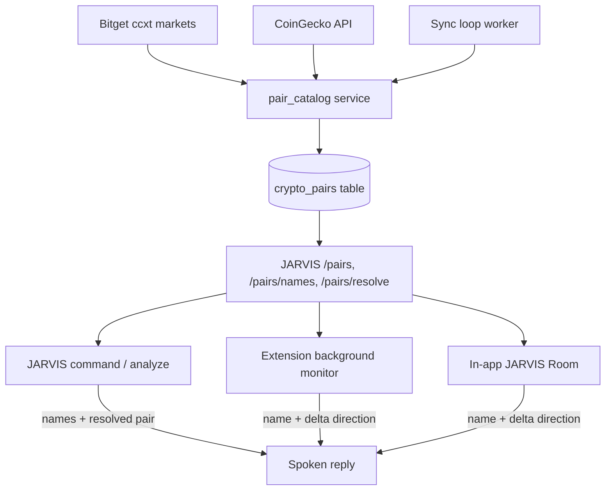

# Requirements

### Overview & Goals
Make JARVIS talk about crypto pairs like a human analyst: use real coin **names** (e.g. `BTCUSDT` → "Bitcoin"), report **change correctly** (right up/down direction plus the delta from the previous reading), resolve **token names to tradeable Bitget pairs** (no more "Bitget does not have that pair"), and give JARVIS a **catalog** of every Bitget-tradeable pair with names, live market cap, 24h volume and a lightweight profile (description, categories, whitepaper/homepage links).

### Scope
#### In Scope
- New backend **crypto-pair catalog** (DB table) seeded from Bitget tradeable markets and enriched from CoinGecko (name, market cap, 24h volume, rank, description, links).
- Background **sync** that keeps the catalog fresh, plus live (cached) market cap / volume lookups.
- **Name/alias resolution service** so a spoken token name ("bitcoin", "btc", "solana") maps to the correct Bitget pair, and JARVIS *learns* aliases the user uses.
- **Fix "read aloud on change"** in the extension monitor (`jarvis-extension/background.js`) and mirror it in the in-app JARVIS Room: correct direction + delta-from-previous-reading + spoken coin names.
- New JARVIS endpoints for the catalog / name-map / single-pair details; wire coin names into command replies and the positions/price UI.
- Graceful spoken fallback when a token truly isn't on Bitget (with a suggestion) instead of a raw ccxt error.

#### Out of Scope
- Full whitepaper document text / deep document Q&A (only lightweight description + links are stored — per decision).
- Adding new exchanges beyond the ones already integrated (catalog is Bitget-focused as requested).
- Changing the trade-execution logic itself (only symbol resolution feeding into it).

### User Stories
- As a trader, when a position's PnL changes I want JARVIS to say the **real coin name** and whether it moved **up or down**, plus **how much it changed since the last reading**, so alerts are unambiguous.
- As a trader, I want to say "how is bitcoin doing" or "buy solana" and have JARVIS find the Bitget pair automatically instead of saying it doesn't exist.
- As a trader, I want JARVIS to know each pair's **name, market cap and volume in real time** and a short profile, so it can talk intelligently about any Bitget token.

### Functional Requirements
1. Catalog stores every Bitget-tradeable pair with: `symbol`, `base`, `quote`, `coingecko_id`, `name`, `description`, `categories`, `links` (whitepaper/homepage/explorer), `market_cap`, `market_cap_rank`, `volume_24h`, `price`, `price_change_24h`, `tradeable`, `updated_at`.
2. Resolution accepts a symbol (`BTCUSDT`, `BTC/USDT`), a ticker (`btc`), or a full name (`bitcoin`) and returns the canonical tradeable pair; unknown inputs return a clear "not found" result with the closest suggestion.
3. "Read aloud on change" speaks: `"<Name> is <up|down> X percent, a change of Y percent <up|down> from the last reading."` — direction derived from the sign of the *delta* (new − previous), not the absolute value.
4. Coin names appear in JARVIS spoken replies, the extension notifications/TTS, and the in-app positions table / price widgets.
5. Market cap + 24h volume are available in real time (cached ≤ ~60s) for any catalog pair and are used when JARVIS discusses a pair.
6. JARVIS learns aliases: when a spoken name/alias resolves (or the user corrects it), the mapping is persisted so future commands resolve instantly.

### Non-Functional Requirements
- Sync + live lookups must respect CoinGecko rate limits (batching + caching) and never block the command/monitor request paths.
- Catalog table auto-creates via the existing `Base.metadata.create_all` startup path (no manual migration).
- Degrade gracefully: if CoinGecko is unavailable, keep last-known catalog values and still resolve/trade from the Bitget list.

# Technical Design

### Current Implementation
- **Read-aloud-on-change** lives in `jarvis-extension/background.js` → `handleUnifiedUpdate()`. It polls `/jarvis/unified-monitor` and, on a PnL threshold breach, speaks `"${p.symbol} is ${pnl_pct>=0?'up':'down'} ${abs(pnl_pct)} percent."` — it uses the **raw symbol** (e.g. `UBUSDT`) and the **sign of the current pnl_pct**, and never reports the change relative to the previous reading. `PNL_THRESHOLD_PCT=3`, `PNL_THRESHOLD_USD=20`.
- The **in-app JARVIS Room** (`frontend/src/pages/jarvis-room.tsx`) polls the same monitor, shows the positions table/price widgets, and speaks via `jarvisSpeak()` (currently only for the volume-divergence watcher, using `splitPair(symbol).base`).
- **Symbol handling**: `backend/app/api/jarvis.py` `_dispatch()` extracts symbols with regex and passes them to ccxt Bitget (`app/exchanges/bitget.py`). When a token isn't a valid market, ccxt raises `bitget does not have market symbol …`, which is what the user hears. `_analyze_symbol()` routes crypto → Bitget, forex/metals → `forex_provider.py`.
- **CoinGecko is already integrated** (key in `settings.COINGECKO_API_KEY`) and used with market-cap/volume/name fields in `app/signals/pump_detector.py` (`/coins/markets`) and `app/api/sentiment.py`. Small hardcoded coin-name maps are scattered (`app/sentiment/news_sources.py` `CRYPTO_KEYWORDS`, `cmc_community.py` `_COIN_NAMES`, `pump_detector.py` `WATCHLIST_COINS`).
- **No `crypto_pairs` table exists.** DB models live in `backend/app/models/database.py`; tables auto-create in `app/core/database.py` `init_db()`. Background loops are registered in `app/workers/runtime.py` (`start_pump_monitor_loop`, etc.).

### Key Decisions
- **Catalog source = Bitget list + CoinGecko enrichment** (user-approved): Bitget ccxt markets define what's *tradeable*; CoinGecko provides names, market cap, volume, description and links. This maximizes coverage using existing infra/keys.
- **Lightweight coin profile** (user-approved): store CoinGecko `name`, `description`, `categories`, official/whitepaper/homepage links, and live market cap + volume — no full whitepaper text.
- **Single source of truth = new `crypto_pairs` table** exposed via `/jarvis/pairs*` endpoints. The extension and frontend fetch a compact `symbol → name` map from the backend rather than each maintaining its own map (replaces scattered hardcoded maps over time).
- **Read-aloud fix applies to extension + in-app room** (user-approved): both compute direction from the *delta* and speak coin names.
- **Resolution is server-side** in a reusable helper so both the command dispatcher and the metadata endpoints share one code path; learned aliases persist in the catalog.

### Proposed Changes
1. **DB model** — add `CryptoPair` to `backend/app/models/database.py` (`__tablename__ = "crypto_pairs"`) with the fields listed in Requirements + a JSON `aliases` column for learned names. Auto-created by `init_db()`.
2. **Catalog service** — new `backend/app/services/pair_catalog.py`:
   - `sync_catalog()`: load Bitget markets (ccxt) → upsert tradeable rows; map `base` → CoinGecko id via cached `/coins/list`; batch-enrich via `/coins/markets` (market cap, volume, rank, price, 24h change, name); fetch lightweight `/coins/{id}` profile (description, categories, links) with throttling.
   - `resolve(query) -> CryptoPair|None`: match by exact symbol, `BASE/QUOTE`, ticker, name, or learned alias (case-insensitive), with a fuzzy fallback + suggestion.
   - `get_market_snapshot(symbol)`: cached (~60s) live market cap + volume + price.
   - `learn_alias(alias, symbol)`: persist a user-said alias.
3. **Background sync** — register `start_pair_catalog_sync_loop()` in `app/workers/runtime.py` (full enrich every few hours; market cap/volume refresh more often) following the existing `start_*_loop` pattern; also run once on startup if the catalog is empty.
4. **Endpoints** in `backend/app/api/jarvis.py`:
   - `GET /jarvis/pairs` — searchable catalog list (symbol, name, market cap, volume, rank).
   - `GET /jarvis/pairs/names` — compact `{ symbol: name }` map for the extension + frontend.
   - `GET /jarvis/pairs/resolve?q=` — resolve a token/name to a pair (+ live market cap/volume/profile), or a not-found suggestion.
5. **Command wiring** — in `_dispatch()` / `_analyze_symbol()`, run user token input through `resolve()` before hitting ccxt; on success speak using the resolved **name**; on failure return a friendly spoken message ("I couldn't find a Bitget pair for X — did you mean Y?") instead of the raw ccxt error; call `learn_alias()` when the user's phrasing resolves.
6. **Extension** — `jarvis-extension/background.js`: keep a per-position `prevPnlPct` in the snapshot; compute `delta = new − prev`; speak name + direction(delta) + delta magnitude; fetch and cache the `symbol → name` map from `/jarvis/pairs/names` (via existing `apiFetch`).
7. **In-app room** — `frontend/src/pages/jarvis-room.tsx`: add a small `coinName(symbol)` helper backed by `/jarvis/pairs/names`; use names in `jarvisSpeak()` messages and render names in the positions table and price widgets; apply the same delta/direction phrasing for spoken change alerts.
8. **API client** — `frontend/src/services/api.ts`: add `jarvis.pairs()`, `jarvis.pairNames()`, `jarvis.resolvePair(q)`.

### Data Models / Contracts
```python
class CryptoPair(Base):
    __tablename__ = "crypto_pairs"
    id = Column(Integer, primary_key=True)
    symbol = Column(String, unique=True, index=True)   # "BTC/USDT"
    base = Column(String, index=True)                  # "BTC"
    quote = Column(String)                              # "USDT"
    coingecko_id = Column(String, nullable=True)        # "bitcoin"
    name = Column(String, index=True)                  # "Bitcoin"
    description = Column(Text, nullable=True)
    categories = Column(JSON, nullable=True)
    links = Column(JSON, nullable=True)                 # whitepaper/homepage/explorer
    aliases = Column(JSON, nullable=True)               # learned user aliases
    market_cap = Column(Float, nullable=True)
    market_cap_rank = Column(Integer, nullable=True)
    volume_24h = Column(Float, nullable=True)
    price = Column(Float, nullable=True)
    price_change_24h = Column(Float, nullable=True)
    tradeable = Column(Boolean, default=True)
    updated_at = Column(DateTime(timezone=True))
```
```text
GET /jarvis/pairs/names  -> { "BTC/USDT": "Bitcoin", "BTCUSDT": "Bitcoin", ... }
GET /jarvis/pairs/resolve?q=solana -> { ok, symbol:"SOL/USDT", name:"Solana",
     market_cap, volume_24h, price, description, links } | { ok:false, suggestion }
```
Read-aloud phrasing (extension + room):
```text
"Bitcoin is down 5 percent, a change of 8 percent down from the last reading."
```

### File Structure
- `backend/app/models/database.py` — add `CryptoPair` (modified).
- `backend/app/services/pair_catalog.py` — catalog sync + resolve + snapshot (new).
- `backend/app/workers/runtime.py` — register catalog sync loop (modified).
- `backend/app/api/jarvis.py` — `/pairs`, `/pairs/names`, `/pairs/resolve`; wire resolution + name speech + graceful errors into `_dispatch`/`_analyze_symbol` (modified).
- `frontend/src/services/api.ts` — pair clients (modified).
- `frontend/src/pages/jarvis-room.tsx` — coin names + delta phrasing in speech/UI (modified).
- `jarvis-extension/background.js` — delta/direction fix + name map (modified).

### Architecture Diagram


### Risks
- **CoinGecko rate limits / symbol→id ambiguity** (many coins share a ticker). Mitigation: prefer the highest-market-cap match for a ticker, cache `/coins/list`, batch `/coins/markets`, and store the chosen `coingecko_id` so it's stable.
- **Extension message-service TTS** can't be exercised headlessly. Mitigation: verify the delta/direction + name logic by unit-level review and by driving `/jarvis/pairs/names` and the monitor payloads.
- **Catalog freshness vs load**: split cadence (slow full enrich vs faster market-cap/volume refresh) and cache live snapshots to keep monitor/command paths fast.

# Testing

### Validation Approach
Verify each layer with the checks an agent can run: `python -m py_compile` for backend, `npx tsc --noEmit` for frontend/extension types, live `curl` against the new endpoints on the running backend (`:1448`), and a browser walkthrough of the JARVIS Room. Extension TTS is validated by logic review + feeding representative monitor payloads.

### Key Scenarios
- **Catalog sync**: after startup/sync, `GET /jarvis/pairs` returns Bitget-tradeable pairs with non-empty `name`, and `market_cap`/`volume_24h` populated for major coins (BTC, ETH, SOL).
- **Name map**: `GET /jarvis/pairs/names` returns `BTCUSDT`/`BTC/USDT` → `"Bitcoin"`.
- **Resolution**: `GET /jarvis/pairs/resolve?q=bitcoin`, `?q=btc`, `?q=btcusdt` all resolve to `BTC/USDT`; a made-up token returns `ok:false` with a suggestion.
- **Command path**: a JARVIS command using a token name (e.g. "how is solana doing") resolves to the Bitget pair and the reply/speech uses "Solana" — no raw "Bitget does not have that pair".
- **Read-aloud direction/delta**: given two consecutive monitor readings for one position, the spoken string names the coin and reports the correct up/down direction of the *delta* plus the delta magnitude.
- **In-app room**: positions table and price widgets show coin names; spoken change/alert messages use names + delta phrasing.

### Edge Cases
- CoinGecko unreachable → catalog keeps last-known values; resolution/trading still works from the Bitget list.
- Ticker collisions (e.g. duplicate symbols) → highest-market-cap coin chosen; stored `coingecko_id` keeps it stable.
- Position with no previous reading (first sight) → announce current value without a bogus delta.
- Non-crypto/MT5 symbols → skip crypto name resolution (unchanged behavior).

### Test Changes
- No formal test suite is assumed; validation is via compile/type-check + endpoint curls + browser walkthrough. If lightweight unit checks are cheap to add, cover `resolve()` (symbol/ticker/name/alias) and the delta/direction phrasing helper.

# Delivery Steps

### ✓ Step 1: Build the crypto-pair catalog (DB + sync service)
A `crypto_pairs` table is populated with every Bitget-tradeable pair, enriched with names, market cap, 24h volume and a lightweight profile from CoinGecko.

- Add `CryptoPair` model to `backend/app/models/database.py` (symbol, base, quote, coingecko_id, name, description, categories, links, aliases, market_cap, market_cap_rank, volume_24h, price, price_change_24h, tradeable, updated_at); relies on existing `init_db()` `create_all`.
- Create `backend/app/services/pair_catalog.py` with `sync_catalog()`: load Bitget ccxt markets as the tradeable source of truth, map base→CoinGecko id via cached `/coins/list`, batch-enrich via `/coins/markets`, and fetch lightweight `/coins/{id}` profile (description, categories, links) with throttling.
- Register `start_pair_catalog_sync_loop()` in `backend/app/workers/runtime.py` (slow full enrich + faster market-cap/volume refresh), plus a one-time sync on startup when the catalog is empty.
- Degrade gracefully when CoinGecko is unavailable (keep last-known values).

### ✓ Step 2: Add resolution + catalog endpoints and API clients
JARVIS can resolve any token name/ticker/symbol to a Bitget pair and expose the catalog to the UI and extension.

- In `backend/app/services/pair_catalog.py` add `resolve(query)` (exact symbol / BASE-QUOTE / ticker / name / learned alias + fuzzy suggestion), `get_market_snapshot(symbol)` (cached ~60s live market cap/volume/price), and `learn_alias(alias, symbol)`.
- Add endpoints in `backend/app/api/jarvis.py`: `GET /jarvis/pairs` (searchable list), `GET /jarvis/pairs/names` (compact symbol→name map), `GET /jarvis/pairs/resolve?q=` (resolved pair + live metadata or not-found suggestion).
- Add clients in `frontend/src/services/api.ts`: `jarvis.pairs()`, `jarvis.pairNames()`, `jarvis.resolvePair(q)`.
- Validate with `curl` for bitcoin/btc/btcusdt and a made-up token.

### ✓ Step 3: Wire name resolution + graceful errors into JARVIS commands
JARVIS uses real coin names in replies and never says "Bitget does not have that pair" for a valid token.

- In `backend/app/api/jarvis.py` `_dispatch()` and `_analyze_symbol()`, run the extracted token/symbol through `resolve()` before calling ccxt Bitget.
- On success, speak/reply using the resolved `name` (e.g. "Bitcoin"), and use `get_market_snapshot()` so JARVIS can mention live market cap/volume.
- On failure, return a friendly spoken message with the closest suggestion instead of the raw ccxt error.
- Call `learn_alias()` when a user's phrasing resolves, so JARVIS learns the names over time.

### ✓ Step 4: Fix 'read aloud on change' in the extension monitor
The extension announces PnL changes with the correct up/down direction, the delta from the previous reading, and the real coin name.

- In `jarvis-extension/background.js` `handleUnifiedUpdate()`, store `prevPnlPct` per position in the snapshot and compute `delta = newPnlPct − prevPnlPct`.
- Rewrite the spoken string to: `"<Name> is <up|down> X percent, a change of Y percent <up|down> from the last reading."`, with direction derived from the sign of the delta.
- Fetch and cache the `symbol → name` map from `/jarvis/pairs/names` (via existing `apiFetch`) and use names in both notifications and TTS; fall back to the symbol when unknown.
- Handle first-sight positions (announce current value, no bogus delta).

### ✓ Step 5: Apply coin names + delta phrasing in the in-app JARVIS Room
The in-app room shows coin names and speaks changes with the same correct direction/delta phrasing as the extension.

- In `frontend/src/pages/jarvis-room.tsx`, add a `coinName(symbol)` helper backed by `jarvis.pairNames()` (cached in state).
- Use coin names in `jarvisSpeak()` messages (volume-divergence and any change announcements) and apply the delta/direction phrasing consistent with the extension.
- Render coin names in the active-positions table and the price widgets.
- Verify via browser walkthrough (names shown, correct spoken phrasing) and `npx tsc --noEmit`.