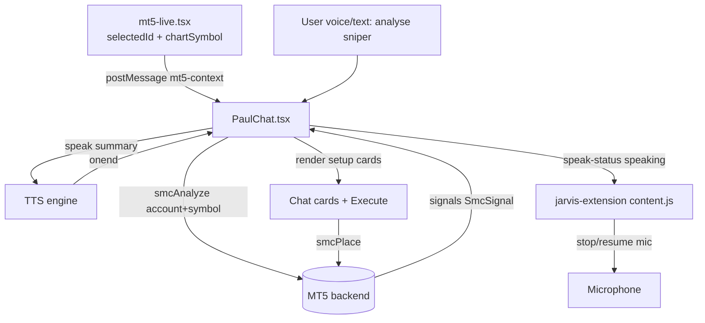

# Requirements

### Overview & Goals
On `http://localhost:3000/mt5-live`, make the JARVIS assistant (`PaulChat`) a first-class way to work the **SMC Sniper** strategy:

1. You can ask JARVIS to **analyse** the current symbol/account for sniper setups.
2. JARVIS **reads the result aloud** (spoken summary of bias + top setups).
3. JARVIS renders **one-tap Execute buttons** in the chat for each ranked Sniper Setup, which place the limit order (SL/TP) exactly like the chart's existing “Place Limit + TP”.
4. Whenever you converse with JARVIS, it **never hears its own voice** while it is responding/talking — the microphone is fully muted during speech and resumes after.

### Scope
#### In Scope
- A page→JARVIS **context bridge** so the chat knows the currently selected MT5 account + chart symbol on `/mt5-live`.
- A **sniper-analysis intent** in `PaulChat` that calls the existing `apiClient.mt5.smcAnalyze(...)`, produces a spoken summary, and renders setup action cards.
- **Execute buttons** wired to the existing `apiClient.mt5.smcPlace(...)` (place pending limit + TP).
- **Mic muting during TTS** for the in-page recognizers and the browser extension, with resume after speech ends.

#### Out of Scope
- Changing the SMC strategy engine / backend analysis logic.
- New backend endpoints (we reuse `smcAnalyze`, `smcPlace`).
- Voice features on pages other than `/mt5-live` (the analysis cards are page-scoped; the mic-muting fix is global since `PaulChat` is global).
- Immediate market-order execution (we place pending limit + TP, per decision).

### User Stories
- As a trader on `/mt5-live`, I want to say/type “Jarvis, analyse sniper setups” and have JARVIS analyse the currently selected symbol, so I don't have to specify it manually.
- As a trader, I want JARVIS to read the analysis aloud so I can keep my eyes on the chart.
- As a trader, I want Execute buttons in the chat for each ranked setup so I can place a limit order without leaving the conversation.
- As a user, I want JARVIS to stop listening while it talks so it never reacts to its own voice during a conversation.

### Functional Requirements
- **Analysis trigger:** A command containing analyse/sniper intent (e.g. “analyse sniper setups”, “sniper entries”) while on `/mt5-live` runs `smcAnalyze` for the page's selected account + `chartSymbol`.
- **Spoken summary:** JARVIS speaks a concise summary (symbol, bias/momentum, and the top 1–3 setups with side/entry/SL/TP/RR). The same text appears as an assistant message.
- **Setup cards:** Each ranked setup renders a card showing side (BUY/SELL), entry, SL, TP, RR and confidence, with an **Execute** button.
- **Execute:** Pressing Execute calls `smcPlace` (pending limit + SL/TP) for the page account/symbol and shows success/failure inline; on success the page positions/orders refresh.
- **No account/symbol context:** If JARVIS is not on `/mt5-live` or no account/symbol is known, it replies that it needs the MT5 Live page open with an account selected (and does not fabricate a setup).
- **Mic gating:** While `isSpeakingRef` is true, the in-page wake/dictation recognizers and any Whisper recording are stopped, and the extension is told to stop listening; recognition resumes only after speech ends.

### Non-Functional Requirements
- Reuse existing endpoints/contracts — no backend changes.
- Feature must degrade gracefully (no JARVIS crash) when MT5 is unavailable or analysis returns no setups.
- Live-account safety: Execute uses the same pending-limit path already vetted by the chart UI.

# Technical Design

### Current Implementation
- **Page:** `frontend/src/pages/mt5-live.tsx` — holds `selectedId` (account) and `chartSymbol` (default `XAUUSD`), and renders `MT5SniperChart` (`chartMode === 'sniper'`).
- **Sniper engine (frontend):** `frontend/src/components/MT5SniperChart.tsx` — calls `apiClient.mt5.smcAnalyze(accountId, symbol)` → `Analysis` with `signals: SmcSignal[]` (`side`, `entry`, `stop_loss`, `take_profit`, `tp1/2/3`, `rr`, `confidence`, `zone_kind`, `lot`...). The `placeSignal()` handler calls `apiClient.mt5.smcPlace({ account_id, symbol, side, entry, stop_loss, take_profit, volume, comment })` behind the “Place Limit + TP” button.
- **Assistant:** `frontend/src/components/PaulChat.tsx` — global JARVIS widget mounted in `Layout`. Key pieces:
  - `Message` type (`id`, `role`, `content`, `pending`, `fromHistory`) and the message list renderer (~line 2400) which currently renders only `msg.content`.
  - `speak()` (~line 732): TTS via OpenAI or Web Speech; sets `isSpeakingRef.current` and posts `{ __jarvisPage, type:'speak-status', speaking }`.
  - `startWake()` (~line 1711, `rec.continuous = true`) and `startDictation` (~line 1612) plus a Whisper `MediaRecorder` path (~line 1545). These keep the mic open during TTS and only *filter* results.
  - `commandRef`/`resolveIntentRef`/`processExtCommand` dispatch voice & extension commands.
  - Browser extension `jarvis-extension/content.js` owns the mic when connected; on `pageSpeaking` it currently keeps recognition running and only ignores non-wake results.
- **API client:** `frontend/src/services/api.ts` — `mt5.smcAnalyze`, `mt5.smcPlace`, plus `jarvis.*` chat methods already exist.

### Key Decisions
- **Symbol/account source = page context bridge** (chosen): `/mt5-live` publishes the selected account + symbol to JARVIS; the chat does not parse the symbol from speech.
- **Execute = pending limit + TP via `smcPlace`** (chosen): mirrors the existing, already-safe chart flow rather than market orders.
- **Self-listening fix = fully mute mic while speaking** (chosen): stop in-page recognizers + tell extension to stop, then resume after `onend` (drops barge-in mid-speech in favor of zero self-hearing).
- **Rendering = structured action message** : extend `Message` with optional sniper-setup payload and render cards inline, instead of overloading plain text.

### Proposed Changes
1. **Context bridge (`mt5-live.tsx` → `PaulChat`)**
   - On `/mt5-live`, post the active MT5 context to the window using the existing `__jarvisPage` convention, e.g. `{ __jarvisPage: true, type: 'mt5-context', accountId, symbol, balance, currency }`, whenever `selectedId`/`chartSymbol`/balance change.
   - `PaulChat` adds a `message` listener storing the latest context in a `mt5ContextRef` (and clears/ignores it when `router.pathname !== '/mt5-live'`).

2. **Sniper-analysis action (`PaulChat`)**
   - Add an intent detector (regex e.g. `/\b(sniper)\b.*\b(setup|entr|analy)|analy.*sniper/i`) checked in the command pipeline (`commandRef` / dispatch + typed `send`) before falling through to chat.
   - When matched on `/mt5-live` with a known account+symbol: speak a short “Analysing <symbol> for sniper setups, Sir…”, call `apiClient.mt5.smcAnalyze(accountId, symbol)`, then build a summary string and append an assistant `Message` carrying the parsed setups; `speak()` reads the summary (reusing the existing auto-speak-on-new-assistant-message effect, or an explicit `speak(summary)`).
   - If no context/no setups: append a graceful assistant message and speak it.

3. **Setup cards + Execute (`PaulChat` renderer)**
   - Extend `Message` with optional `sniperSetups?: SniperSetupAction[]` (a small local type mirroring the fields needed for display + `smcPlace`).
   - In the message map, when `msg.sniperSetups` is present, render a compact card per setup (side, entry, SL, TP, RR, confidence) with an **Execute** button.
   - Execute handler calls `apiClient.mt5.smcPlace({ account_id, symbol, side, entry, stop_loss, take_profit, volume, comment })` using `mt5ContextRef`, tracks per-setup placing/placed/error state, and shows inline result; optionally posts a `mt5-refresh` message so the page reloads positions/orders.

4. **Mic muting during speech (`PaulChat` + extension)**
   - Introduce a single `muteMicForSpeech()` / `unmuteMicAfterSpeech()` pair: on speak start, stop `wakeRef`/`dictationRef`, abort any active Whisper `MediaRecorder`, and post `{ __jarvisPage, type:'speak-status', speaking:true }`; on `onend`/`onerror`/interrupt, post `speaking:false` and resume `startWake()` (guarded by `wakeEnabledRef`).
   - Update both `speak()` paths (OpenAI audio + Web Speech) to call these consistently.
   - In `jarvis-extension/content.js`, when `pageSpeaking` becomes true, call `stopRecognition()` (and resume via `startRecognition()` when it becomes false) instead of keeping the mic open and merely ignoring results.

### Data Models / Contracts
```ts
// PaulChat local type for chat action cards
interface SniperSetupAction {
  side: 'buy' | 'sell'
  entry: number
  stop_loss: number
  take_profit: number
  rr?: number
  confidence?: number
  zone_kind?: string
  volume?: number   // from signal.lot, fallback 0.01
}

interface Message {
  id: string; role: 'user' | 'assistant'; content: string
  pending?: boolean; fromHistory?: boolean
  sniperSetups?: SniperSetupAction[]   // NEW
}

// Page → JARVIS context bridge message
{ __jarvisPage: true, type: 'mt5-context', accountId: number, symbol: string, balance?: number, currency?: string }
```
Reused contracts (unchanged): `apiClient.mt5.smcAnalyze(accountId, symbol, params?)`, `apiClient.mt5.smcPlace({ account_id, symbol, side, entry, stop_loss, take_profit, volume, comment })`.

### Components
- **`PaulChat.tsx`** (modified): context listener + ref, sniper-analysis intent handler, extended `Message` + card renderer with Execute, mic mute/unmute around `speak()`.
- **`mt5-live.tsx`** (modified): publish MT5 context to JARVIS; optionally listen for a `mt5-refresh` message to refresh after a chat-placed order.
- **`jarvis-extension/content.js`** (modified): stop/resume recognition on `pageSpeaking` transitions.

### File Structure
- `frontend/src/components/PaulChat.tsx` — primary changes (intent, rendering, voice gating).
- `frontend/src/pages/mt5-live.tsx` — context bridge publisher.
- `jarvis-extension/content.js` — mic stop/resume on speak status.
- No new files; no backend changes.

### Architecture Diagram


### Risks
- **Echo tail after TTS:** resuming the mic immediately could catch trailing audio; mitigate with the existing small resume delay (~300ms) already used after `speak()`.
- **Losing barge-in:** muting the mic disables “interrupt JARVIS mid-sentence”; this is the chosen trade-off for zero self-hearing.
- **Stale context:** if the user navigates away, `mt5ContextRef` must be cleared so JARVIS doesn't place orders against an old symbol — guard on `router.pathname`.
- **Volume/lot sizing:** use `signal.lot` when present, else a safe `0.01` default, matching the chart's fallback.

# Testing

### Validation Approach
Validate via the running app at `/mt5-live` with an MT5 account selected, plus targeted checks of the voice gating. Confirm each functional requirement maps to an observable behavior; rely on TypeScript build (`frontend`) passing for type-level correctness of the new `Message` field and handlers.

### Key Scenarios
- **Analyse on page:** With an account selected and `chartSymbol` set, ask “Jarvis, analyse sniper setups” → JARVIS speaks a summary and renders one card per ranked setup with side/entry/SL/TP/RR.
- **Execute:** Press Execute on a setup → `smcPlace` is called with the page account/symbol; success message appears and the page's orders/positions refresh.
- **Spoken read-back:** The summary is both displayed and read aloud (matches the auto-speak-new-reply behavior; not re-spoken on refresh because it isn't `fromHistory`).
- **Mic muting:** While JARVIS speaks (OpenAI TTS and Web Speech paths), the wake/dictation recognizers are stopped and the extension reports not listening; recognition resumes after `onend`.

### Edge Cases
- **Not on `/mt5-live` / no account:** JARVIS replies it needs the MT5 Live page with an account selected; no `smcPlace` call is made.
- **No setups returned:** JARVIS says no qualifying sniper setups were found; no cards render.
- **`smcAnalyze` / `smcPlace` failure:** inline error shown, JARVIS does not crash, mic resumes normally.
- **Navigation mid-session:** leaving `/mt5-live` clears `mt5ContextRef`; subsequent analyse requests fall back to the “need the page” message.
- **Echo check:** after JARVIS finishes a sentence, confirm the resumed recognizer does not immediately trigger on residual audio.

### Test Changes
- No automated test framework changes assumed; verification is manual/behavioral plus a clean `frontend` type-check/build. If lightweight unit coverage is desired later, the sniper-intent regex and summary-builder are pure functions that can be unit-tested in isolation.

# Delivery Steps

### ✓ Step 1: Add MT5 page→JARVIS context bridge
JARVIS knows the account + symbol currently selected on /mt5-live.

- In `frontend/src/pages/mt5-live.tsx`, post `{ __jarvisPage: true, type: 'mt5-context', accountId: selectedId, symbol: chartSymbol, balance, currency }` via `window.postMessage` whenever `selectedId`, `chartSymbol`, or account balance changes.
- In `frontend/src/components/PaulChat.tsx`, add a `message` event listener that stores the latest payload in a new `mt5ContextRef`.
- Clear/ignore the context when `router.pathname !== '/mt5-live'` so stale symbols are never used.
- Optionally listen on the page for a `mt5-refresh` message to reload positions/orders after a chat-placed order.

### ✓ Step 2: Add sniper-analysis intent + spoken read-back in JARVIS
Asking JARVIS to analyse sniper setups on /mt5-live runs the SMC engine and JARVIS reads the result aloud.

- In `PaulChat.tsx`, add a sniper-intent detector (regex matching analyse/sniper/entries) into the command pipeline (`commandRef`/dispatch and typed `send`) before the chat fallback.
- On match with a known `mt5ContextRef`: speak a short 'Analysing <symbol>…' acknowledgement, then call `apiClient.mt5.smcAnalyze(accountId, symbol)`.
- Build a concise summary string (symbol, bias/momentum, top 1–3 setups with side/entry/SL/TP/RR) and append it as an assistant `Message` that is auto-spoken (reusing the existing new-reply TTS effect).
- Handle the no-context and no-setups cases with graceful spoken/displayed messages; never fabricate setups.

### ✓ Step 3: Render Sniper Setup cards with Execute buttons in chat
Each ranked setup appears in the chat as a card with a one-tap Execute that places the limit order.

- Extend the `Message` interface in `PaulChat.tsx` with optional `sniperSetups?: SniperSetupAction[]` and populate it from the `smcAnalyze` signals.
- In the message list renderer (~line 2400), render a compact card per setup showing side (BUY/SELL), entry, SL, TP, RR and confidence.
- Add an Execute button per card that calls `apiClient.mt5.smcPlace({ account_id, symbol, side, entry, stop_loss, take_profit, volume, comment })` using `mt5ContextRef` and `signal.lot || 0.01`.
- Track per-setup placing/placed/error UI state, show inline success/failure, and post `mt5-refresh` to the page on success.

### ✓ Step 4: Mute the microphone while JARVIS is speaking
JARVIS no longer hears its own voice during a conversation.

- In `PaulChat.tsx`, add `muteMicForSpeech()`/`unmuteMicAfterSpeech()` helpers that stop `wakeRef` and `dictationRef`, abort any active Whisper `MediaRecorder`, and post `speak-status` accordingly.
- Call mute at the start of both `speak()` paths (OpenAI audio + Web Speech) and unmute on `onend`/`onerror`/interrupt, resuming `startWake()` only when `wakeEnabledRef` is true (keep the existing ~300ms resume delay to swallow echo tail).
- In `jarvis-extension/content.js`, when `pageSpeaking` becomes true call `stopRecognition()`, and call `startRecognition()` when it becomes false — instead of keeping the mic open and merely ignoring non-wake results.